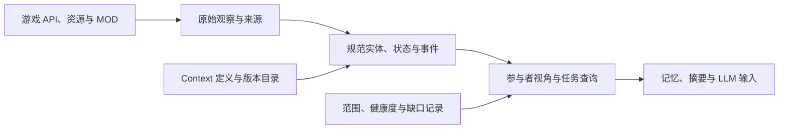

# Context 能否“不重不漏”：首轮研究

> 归档说明（2026-09-14）：本文保留整理前的阶段研究和结论，文中的“当前”“下一步”均属于原阶段，不作为新实现要求。仅修正位置相关链接及失效锚点。当前开发以[三模块总体设计](../../modular-context-provider.md)和[开发与参考基线](../../reference-baseline.md)为准。原路径：`docs/context-coverage-study.md`。

日期：2026-09-11。状态：静态源码与历史样本调研，尚未进行本项目游戏实测。证据编号对应[参考资料基线](reference-baseline.md)。下文采集架构和验收要求是建议方案，不是本仓库现有能力。

## 1. 结论

**现有资料不能支持“收齐整个游戏的一切 Context，且永不重复”的承诺。可以把固定版本、固定采集范围内的事实唯一性、状态覆盖、事件链完整性做成明确且可验收的工程目标。**

这里有四个不同问题：

| 层次 | “不重”的含义 | “不漏”的边界 |
| --- | --- | --- |
| 定义目录 | 每个定义身份唯一，别名有明确映射 | 针对固定源码、资源、DLC 和 MOD 输入枚举；动态及原生部分列出缺口 |
| 运行时状态 | 同一实体同一属性的同一版本只有一份规范事实 | 指定实体、字段、时点及读取精度；未实例化不等于不存在 |
| 事件历史 | 同一次发生只建立一个规范事件；多个观察与参与者视角可引用它 | 从采集生效到结束的指定事件集合；加载前历史、异常中断和未接入写入路径有边界 |
| LLM 上下文 | 一个事实可被多个视角引用，避免重复计数或重复叙述 | 对具体任务保留必要证据；有损摘要不能承诺包含全量原始信息 |

因此可以承诺并验证“某份采集契约内达到什么程度”，不能拿“目录条数很多”“hook 注入成功”或“没有重复 event_id”代替完整性证据。

## 2. 三个项目分别提供了什么

### 2.1 Atlas：候选目录和源码导航

本轮直接读取三份看板数据，得到：

| 数据组 | 数量 | 解释 |
| --- | ---: | --- |
| 原始登记 Context | 12,687 | 11,792 条账本范围加 895 条补充，适合作为目录种子 |
| 源码对象字段 | 19,057 | 静态字段身份，不代表每个实例都存在且可安全读取 |
| 函数参数与临时数据 | 239,390 | 与词法作用域相关的源码身份，不宜直接作为长期存储字段 |
| 合计 | 271,134 | 本轮检查身份无重复；不等于 271,134 个互相独立的运行时事实 |

同一个饥饿值可以在字段、getter 返回值和多个函数参数中出现；静态身份不同，运行时可能指向同一个事实。反过来，同一个字段定义可以对应数百个 Sim 的不同值。静态 ID 与运行时事实必须另外建立映射。

原账本 45,178 条关系中，本轮统计出 5,878 accepted、38,941 pending、359 unresolved。accepted 只是原账本状态，并不自动表示游戏实测成立。看板清单还声明 8 个文件存在语法缺损。[A1–A4]

**可复用方式：**保留 Atlas 身份和来源，逐项添加“运行时 owner、读取方式、变更观测点、适用版本、状态/事件/规则类别、验证结果”。不能直接把静态目录全量序列化后宣称采集完成。

### 2.2 sims4-python / Observer：丰富但有明确边界的观测

Observer 源码 `0.12.16` 能提供状态、交互生命周期、Autonomy 候选、评分来源、Test Readset 与随机选择记录。这对解释行为和检查 Experience 的简化结果很有价值。

其源码契约明确限制了：

- 按 tick 的 Sim 快照面向已加载地块中的实例化 Sim。
- 场外、未实例化 Sim 和 Away Action 不做同样的决策追踪。
- 不经过所选 Python callable 的 Native 决策不在契约内。
- Native 寻路、姿势和连接性的一部分只记录返回的判断结果，无法据此独立还原其内部计算。
- Forensic 虽然记录更多调用，参数仍是摘要；深度和集合采样有上限。[P1–P3]

Observer README 声明过一轮 BASE_GAME、7200 tick、93,971 条事件的验证，这属于指定场景结果，不代表所有 DLC、MOD、时段都覆盖。[P4]

### 2.3 Experience：可用的经历原型，采集有损且存在待补面

六类经历 `did / received / perceived / changed / joined / decided` 很适合作为“Sim 经历”的投影。它们尚不足以定义全游戏 Context，例如纯物件变化、家庭资产、离场推进、全量规则和未发生的行动约束。[E1、E11]

| 当前实现或观察 | 对“不重不漏”的影响 | 证据 |
| --- | --- | --- |
| 交互主要记录终态；首次 zone 就绪后安装主体 hook | 采集开始前的事实和窗口末尾仍在执行的交互，不能仅靠终态流恢复 | E2、E8 |
| 决策候选只取表的前 5 条；skip 合并为 300 秒现实时间窗口 | 适用于简化经历，不能当作完整决策输入与历史 | E3 |
| 广播使用 120 秒现实时间冷却 | 窗口内的独立再进入与持续命中可能被合并；时间窗去重不等于身份去重 | E4 |
| 参与者字段最多 6 个，同场物件最多 8 个且受距离限制 | 有字段也不等于全体成员/物件已枚举；需要截断与总量信息 | E2 |
| verb、Loot op、Loot 容器黑名单在落盘前过滤 | 某些原始观察不可恢复；应与真正的传输丢失分别计数 | E6 |
| Loot hook 主要记录 subject 为 Sim 的 op；设计中的若干专用 hook 未在注册清单发现 | 不能由“覆盖 Loot”推出所有对象、职业、关系或离场变化均被采到 | E5、E8、P6 |
| 每 Sim 只有一个 `CURRENT_CONTAINER` | 同时参与多个非背景 Situation 时无法完整表达所有成员关系，后写者会占用当前槽 | E7、E9 |
| 交互幂等集合超过上限后整体清空 | 幂等保证有保留窗口，不能视为持久的全局恰好一次 | E2 |
| 内存队列有上限；写盘前先出队 | 不能保证崩溃或 I/O 故障时零丢失；台账队列溢出路径也没有独立 drop 计数 | E7 |
| 场次按启动时间戳区分，跨场次累积画像 | 尚不足以隔离不同存档及读档回滚分支 | E7、E10 |

另外必须区分“执行了一次函数”“尝试施加效果”和“实际值发生变化”。例如 `None` 返回值未必能区分成功、无目标或空分支；只在函数返回后发事件，不能自动证明效果发生。`inert` 当前也是按配置名单标记，不能作为所有调用均无副作用的通用证明。[E4–E6]

## 3. 历史样本重新核验

本轮逐行读取三个数据集的全部 Sim 文件，在各自全部已提供场次内解析引用。没有按截取时间窗口建立不完整的 ID 索引。

| 样本 | 事件数 | 重复 event_id 额外行 | 带 parent 的行 | 在样本内找不到 parent 的行 | 悬空 container 行 |
| --- | ---: | ---: | ---: | ---: | ---: |
| `win0910` | 3,934 | 0 | 1,028 | 2 | 0 |
| `win0903` | 1,962 | 0 | 833 | 0 | 0 |
| `aotrace0903` | 3,055 | 0 | 1,644 | 3 | 0 |

按 `(parent_id, sim_id, by, verb, status)` 检查有 parent 的 received，三个样本均未发现重复候选组。这只是一个局部检查，不能证明所有语义事件都没有重复。

`win0910` 的 667 条 did 中没有 `co_present` 字段；对应 health 记录 interaction errors=664，最后错误为 `zone object enumeration unavailable`，并报告 dropped 总计 1,110。当前源码已有相关修复，但该历史数据没有因此变成完整数据。

这些数字只说明：

- 已落盘的 ID 唯一性良好。
- 5 条引用在提供的数据中无法闭合；仅凭样本不能确定是过滤、尚未结束的交互、写入丢失，还是导出边界导致。
- `parent_id=null` 不被计为悬空，天然根事件也不该被误判为漏采。
- health 的 dropped 混合过滤和缓冲丢弃，且计数时段需要核对，不能直接计算“全游戏漏采率”。

复现脚本与输入摘要见[参考基线](reference-baseline.md#4-历史审计方法与结果)和[完整聚合结果](research/2026-09-11-reference-audit.json)。这三个历史样本不能作为 `0.7.25` 当前源码的验收。

## 4. 为什么绝对“不漏”无法由现有方案保证

### 4.1 先前历史不能从终态唯一还原

假设两次快照的饥饿值都是 50，中间可能完全没变，也可能先变成 40 再恢复到 50。快照对账只能发现净差，不能恢复所有中间事件。即使最终状态完全一致，也不能据此证明事件没有漏采。

安装 MOD 前、首次 hook 生效前、离线期间及崩溃前未持久化的历史，都应声明观测边界。存档里的轨道、记忆或里程碑可以补当前已保存的信息，不能保证补回每次交互的时间和因果。

### 4.2 没有已经证明涵盖所有变化的单一事件总线

TestEvent 适用于显式发出的事件；Loot 是一类效果执行入口；GSI 面向特定调试归档。直接 stat/tracker 写入、其他系统调用、Native 内部变化及第三方 MOD 自有存储，都需要另行核对。[P6、P8、E5]

未知 MOD 还可能替换 hook、直接写私有字段或在安装之后定义新类。允许安装任意 MOD，就不能假设采集宇宙是封闭集合。

### 4.3 游戏没有计算出的细节不能凭空恢复

未实例化 Sim 可能只有较低精度的后台状态，其行为不一定按在场 Sim 的完整交互流程模拟。可以收集真正发生的后台变化、标明 LOD；不应补造一份“等同于全程在场”的经历。

同样，获取 Native 判断结果有助于解释某次选择，但不等于拥有完整内部搜索过程。若确需 Native 层采集，需要独立评估二进制插桩成本、版本兼容性和新增边界，不能把它算成现有 Script Mod 能力。

### 4.4 语义与因果不总是单一答案

情绪可以由多个 Buff 的权重共同形成。一次聊天、一次 Buff 更新、一次情绪变化是相关而不同的事实；不应因为“说的是同一件事”就合并，也不能硬挂一条单因果边。时间邻近、同场和真实因果应分开。[E10]

LLM 的总结、印象与推断还需要与客观观测分开保存。将主观记忆反馈到行为后，应继续记录它的来源和影响，不能让推断变成无来源的新事实。

## 5. 建议如何实现“不重”

### 5.1 保留三个层次，分别确定身份

原始观察允许多来源交叉核验；规范事实按经证实的身份合并；参与者视角和语义摘要引用规范事实。避免为了“去重”把唯一的证据也丢掉。

| 身份对象 | 建议组成 | 不应采用的捷径 |
| --- | --- | --- |
| 静态定义 | 来源命名空间、canonical ID、源码/资源版本；资源保留 TGI、包与覆盖来源 | 用中文名或 tuning 名判断全局唯一 |
| 持久实体 | 存档谱系、读档分支、实体类型、游戏持久 ID | 跨存档按数值 ID、名字或人格自动合并 |
| 临时实体 | 运行会话、zone 加载代次、类型、实例 ID，并保留已核验的持久 ID 映射 | 使用 Python `id()` 充当跨会话主键 |
| 原始观察 | 采集器实例 UUID、单调序号；同时记录会话与 tick | 仅用秒级时间戳或 payload hash 判断唯一 |
| 规范事件 | 来源命名空间、作用域、已核验的发生 ID、生命周期阶段；必要时使用分配的发生序号 | 合并同一 tick 内内容相同但独立发生的两次动作 |
| 状态版本 | 实体、属性定义、观测版本/适用时间、来源 | 把两个时刻值相同理解为期间从未改变 |
| 参与者投影 | 规范事件 ID、视角主体、角色 | 把 A 的 did 与 B 的 received 相加后当成两次拥抱 |

所有 64 位游戏 ID 在 JSON/浏览器接口中建议使用十进制字符串，避免 JavaScript Number 精度损失导致身份碰撞。静态别名与运行时别名分别登记，合并依据不足时保留独立记录并标待核验。

### 5.2 多来源关联不能只靠时间窗

Observer 与 Experience 可以同时观察同一交互；优先使用同一会话、同一世界分支下的 interaction ID、actor 和生命周期阶段关联。共享不到同一个发生 ID 时，只能建立带依据的候选关联，不能通过“时间差很小”直接删掉其中一条。

一个拥抱可以有一个规范发生、A 的主动视角、B 的接受视角及两个人的状态变化。视角可以各自计数；世界事件总数只计算规范发生。没有可靠证据的“目睹”不能从同房或在附近推断出来。

## 6. 建议如何实现可审计的“不漏”

### 6.1 首先固定采集契约

每份 capture manifest 至少声明：

- 游戏 build、DLC 清单、MOD 名称/版本/哈希及已知加载顺序；源码和资源目录版本。
- 存档谱系、当前保存节点、读档分支、运行 session、zone 加载代次。
- 目标实体范围：当前玩家户、在场 Sim、场外 Sim、物件、家庭或世界；各自的 LOD。
- 必须收集的状态字段、事件类型、精度、采样策略及生效/结束边界。
- collector 与 schema 版本、已安装 hook、过滤/截断配置、持久化水位和异常。

换版本、安装新 MOD 或变更覆盖顺序后，旧契约的覆盖结论不能自动继承。

### 6.2 每个定义都登记采集能力和缺口

由 Atlas 目录起步，但允许新增 MOD 自有命名空间，以及补充 Atlas 未建模的数据。每项登记：语义、owner、静态/状态/事件/派生类别、getter、写入入口或 listener、适用版本、去重键、初始快照方式、精度和证据。

观测值需要明确区分 `captured`、`not_applicable`、`uninstantiated`、`unsupported`、`not_observed`、`error`、`filtered`、`truncated` 等状态；集合同时说明枚举范围和是否截断。`null`、空列表、无数据和读取失败不能使用同一种含义。

覆盖状态“全部有交代”只是缺口可审计。必需字段为 unsupported/error 时仍应判定该项验收失败，不能把它算进成功采集分子。

### 6.3 初始快照、增量变化和对账配合

1. 在声明的安全时点建立初始快照，包括已存在的 Buff、关系、Situation 成员及目标物件。
2. 采集选定领域的变更和生命周期；记录真实前后值，区分计划数值、受限后的实际数值和未生效调用。
3. 定期与游戏直接查询的状态对账，并在 zone 切换、保存、加载、退出等边界记录水位。
4. 把无法解释的差异记录为 gap，再决定重同步还是宣告该窗口不完整。

快照自身也需要一致性边界：记录开始/结束 tick、状态版本或明确的非原子范围，避免把跨多个时点读到的字段冒充同一瞬间的世界状态。对账能检查当前状态，不能单独证明中间事件不漏。

### 6.4 分开事实关联与持久化可靠性

因果采用可带多条来源的关系，至少区分直接调用/数据依赖、同情境、时间邻近、系统来源及推断。保留“已证实无单一 parent”“来源未知”“采集窗口外”和“引用应存在但未找到”的不同原因。

Situation/职业/区域采用多成员区间，包含开始、结束或截断原因；游戏时间与现实时间分别保存。读档回滚建立分支，禁止把放弃的未来经历累计进当前角色记忆。

持久化目标可以是：**在已持久化边界内，通过保留事件身份与幂等消费，做到重放不重复计数；对边界外的潜在丢失明确报告。** 不能只靠内存队列加 JSONL 声称端到端恰好一次。需要设计持久日志、确认水位、重试、尾行恢复和消费检查点；这些仍无法追回从未进入采集器的事件。

### 6.5 原始事实与模型所需信息分层保存

规则/资源按实际生效版本索引；运行时事实保留证据；模型按任务检索当前状态、近期经历、有关关系及必要规则。摘要标注使用的事实 ID、生成版本和删减范围，允许下钻原始记录。

角色视角还要区分“系统知道”和“角色能知道”。为角色生成回忆或行动建议时，显式选择知识范围；同场对象和其他 Sim 的隐藏信息不能自动当作角色已经感知的事实。

## 7. 第一阶段验收建议

先选一个固定游戏 build 与 MOD 组合，以当前地块的目标 Sim、关联物件为范围，验证一条端到端链路：

**当前状态 → 做出/接收交互 → 实际 Buff/需求/关系变化 → 情境归属 → 可追溯记忆。**

| 验收面 | 方法 | 通过标准与限制 |
| --- | --- | --- |
| 定义与范围 | 必需目录逐项列采集器、来源、版本与能力 | 所有必需项已覆盖；可选缺口明确，不算成功覆盖 |
| 身份 | 同事件从多 hook 到达、重复导入、重复消费 | 规范事件与统计只增加一次；独立重复动作仍保留 |
| 状态 | 初始快照加已记录变化重建，和独立查询比较 | 指定字段在声明精度内一致；这不单独证明事件全量 |
| 事件 | 可控剧本的预期事件、短窗口 Observer/调用跟踪与目标 hook 差分 | 契约内预期发生都有对应记录；共用 hook 的两个计数器不能充当独立真值 |
| 生命周期 | 完成、取消、异常、窗口内未完成、采集前已开始 | 每条区间闭合，或带明确的跨窗口/截断状态 |
| 引用 | 全量索引核对因果、实体与 Situation 成员关系 | 无无法解释的悬空引用；未知根因不伪装为直接因果 |
| 持久化 | 在受控环境测试写入失败、重启与重复重放 | 已确认记录不丢、不重复计数；未确认窗口按恢复结果报告 |
| 身份连续性 | 旅行、重载、另存、读旧档、两个存档交替 | 已核验的实体可连续追踪；不同存档和分支不混合 |
| 兼容与开销 | 指定 DLC/MOD 组合、hook 冲突、采集耗时和数据量 | 满足事先声明的预算；新版本和新组合重新验收 |

首批场景建议覆盖：单人吃饭与需求变化、双人社交、Buff 自然到期、同 tick 连续变化、离场与返回、并行情境、取消交互、读档回滚。再单独扩展职业/兔子洞、Story Progression、跨地块和第三方 MOD。

## 8. 下一步落点

1. 建立第一版 Context 采集契约和覆盖登记表，选定少量直接服务 LLM 玩法的必需字段。
2. 核定目标游戏、DLC、MOD、存档/分支身份；为每类实体建立持久与运行时 ID 映射。
3. 从 Experience 复用经历结构，从 Observer 复用观测与对账能力，制作最小采集验证原型。
4. 按第 7 节输出带分母、版本、场景和未覆盖项的报告，再决定扩大范围。

不预设现有六类经历或 Atlas 目录已经足够。每次增加玩法需求，都回到“需要哪些事实、来自哪里、如何验证、缺失时怎样表达”更新契约和文档。
