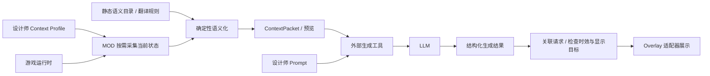

# 阶段研究：规则语义化与面向设计师的 Context 接口

> 归档说明（2026-09-14）：本文保留整理前的阶段研究和结论，文中的“当前”“下一步”均属于原阶段，不作为新实现要求。仅修正位置相关链接及失效锚点。当前开发以[三模块总体设计](../../modular-context-provider.md)和[开发与参考基线](../../reference-baseline.md)为准。原路径：`docs/semantic-catalog-and-context-api.md`。

版本：v0.1。日期：2026-09-11。

本文保留语义字典、运行时 Context 与设计师工具的阶段研究。**当前总体方向已确认为[同一项目内的三个功能模块](../../modular-context-provider.md)，最终全部启用，可以整合为一个 MOD。** 内部接口统一定义，模块解耦用于调整与调试，并可增加阶段验证工具或小插件；下面的接口、工具和执行顺序仍是供下一阶段讨论的草案，不是已冻结的实现要求。

下述字段名、配置、接口和流程属于设计建议；新的字典系统、游戏采集 MOD、设计师工具和 Overlay 返回接口尚未实现。旧离线工具及配套测试已于 2026-09-14 删除，Experience 部分准备重新开发。

## 1. 两条主线及其关系

| 方向 | 职责 | 交付物 |
| --- | --- | --- |
| **A：语义资源与确定性翻译** | 整理游戏定义、资源名称、行为含义和参数/状态表达规则，把代码标识与结构化值转成可核验的语言 | 语义目录、版本化规则表、模板、未知回退、离线示例和验证工具 |
| **B：运行时 Context 服务** | 在选定时刻读取指定实体/范围的游戏状态，按设计师选取的字段输出，并接通生成结果的展示通道 | 采集 MOD、字段目录、查询/输出契约、Context 配置与预览、Overlay 接收/显示适配器 |

A 可以先用静态资料和合成输入开发；B 可以先输出原始结构化值。二者通过稳定的字段和语义标识结合，不互相等待全部完成。

模型负责基于 Context 和设计师 Prompt 创作。基础代码含义、事实状态和单位解释采用规则，不要求每次运行时调用 LLM 翻译。

## 2. “静态游戏运行时数据”的两个含义

这里需要把静态定义与时点快照分开：

| 数据 | 例子 | 放在哪条主线 |
| --- | --- | --- |
| 静态/相对稳定的定义 | 交互 tuning、对象类型、Buff/trait/statistic 的名称与含义、单位、资源引用 | A：离线整理；启动时核对当前游戏、DLC 和 MOD 所加载的版本 |
| 当前时点的状态快照 | 谁在做什么、目标是哪个对象、当前需求值、Buff、关系、地点和 Situation | B：运行时查询；随游戏状态变化 |
| 发生过程/结果 | 某交互开始、完成、取消，以及实际效果 | 需要相应运行证据；A 负责表达规则，不能仅由静态定义推断发生过 |

如果“静态”指暂停游戏后查看某一刻的数据，它仍是运行时快照，而不是可以永久写入翻译表的静态事实。

例如定义目录可以说明 `chess_practice` 表示练习国际象棋；它不能说明 A 今天练习过、现在正在练习，或练习后技能提高了。这些都需要 B 的运行数据或后续事件观测。

## 3. 方向 A：规则表是正确基础，但应支持参数和状态

### 3.1 三个组成部分

| 部分 | 内容 | 例子 |
| --- | --- | --- |
| **名称目录** | 代码/资源身份对应的名称、类别和解释 | `chess_practice` → “练习国际象棋” |
| **语义规则** | 将来源字段规范化为 actor、target、phase、result、数值及单位 | 队列中的计划与已运行交互区别表达；未知结果保持未知 |
| **文本模板** | 根据规范化值生成指定语言的文本 | “A 正在练习国际象棋”“A 的练习国际象棋交互被取消” |

可以统称为规则驱动的语义层。仅有 `代码名 → 中文名` 的字典，适合显示标签；生成忠实的完整句子还需要后两部分。

### 3.2 同一行为的表达示例

以下为规则示例，不是本轮实际采集到的游戏过程：

| 可确认输入 | 建议输出 |
| --- | --- |
| 只有定义 `chess_practice` | 练习国际象棋 |
| 明确处于队列中、尚未开始 | A 已排队等待练习国际象棋 |
| 明确处于运行阶段 | A 正在练习国际象棋 |
| 观察到 `Complete` 终态 | A 的练习国际象棋交互已完成 |
| 观察到 `user_cancel` 终态 | A 的练习国际象棋交互被取消 |
| 只有交互名称，阶段未知 | A 的关联交互：练习国际象棋；阶段未知 |

技能提升、输赢、情绪变化分别要求相应事实，不能从动作名或 `Complete` 自动补出。内部调度动作也不应一律翻译成面向玩家的完整行为。

### 3.3 规则项应保存什么

建议每条规则记录：

- **身份**：项目语义 key、来源资源/tuning ID、资源类别、DLC/MOD 来源；名称可作兼容匹配依据，但不是永久唯一身份。
- **适用范围**：游戏/资源版本、输入 schema、语言；当前加载资源与离线目录不符时可降级。
- **输入要求**：需要哪些字段，哪些角色/状态值已验证；缺字段时怎样回退。
- **表达内容**：规范化类型、显示标签、分阶段/结果模板、参数及单位。
- **证据与质量**：来源定位、规则版本、人工审核或游戏核验状态、已知限制。

规则采用可编辑的数据配置和有限的模板/条件表达，避免要求策划编写任意 Python 才能增加一种描述。初期尽量使用精确映射和少量经过验证的规则族。

### 3.4 名称资源与翻译表的关系

优先使用已确认的游戏名称和本地化资源，项目规则补充其缺失的行为含义、角色和状态表达。已有源码中的 `LocalizedString` 可能只是 hash/token 结构，不保证直接转 Python 字符串就得到客户端显示文本；静态 STBL 的解析、token 展开和 MOD 覆盖顺序需要验证。

运行时需要做的是查表、填入实体名字/目标/数值、选择适用模板；词义和基础规则可以离线准备。动态名称覆盖、同名 MOD tuning 和缺失资源应有确定回退，不能被错误合并。

未知项保留原始标识，并输出“未映射”或“部分解析”。用户界面可以显示友好的占位名称，但原始数据和缺失状态仍可回查。

### 3.5 输出结构化值与文本

不要让自然语言成为唯一的数据接口。翻译结果仍应保留原始标识、规范化语义、实际参数、状态和规则版本；文本是其中一种表示。

设计师可选择紧凑结构化数据、确定性文本或二者结合。生成请求按需要裁剪，完整调试包可另外留存，避免把每个字段的双份表达都无条件塞进 Prompt。

LLM 如用于离线辅助起草词条，应经过审核、版本化和测试后才进入规则表；它不参与运行时基础事实的临时猜译。

## 4. 方向 B：提供 Context 服务和设计师可用的配置

“采集可能有意义的所有 Context”需要转成可选的字段能力目录。采集层负责准确、可用和有界，设计师决定某个玩法需要哪些字段；两者通过声明式 Context Profile 连接。

### 4.1 字段目录是输出接口的一部分

每个可选字段应描述：

| 元数据 | 设计师需要知道什么 |
| --- | --- |
| key、中文名称、说明、示例 | 这是什么数据，怎么选 |
| 数据类型、数量、单位/范围 | 单值或列表、数字或枚举的含义；需求值不默认都是 0–100 |
| 适用实体和范围 | 玩家 Sim、未实例化 Sim、当前地块 Object 等有哪些差异 |
| 读取来源和能力状态 | 当前版本是否支持、是否已游戏验证 |
| 更新频率、采集成本和数量限制 | 是缓存定义、按需实时值，还是高成本枚举 |
| 缺失状态 | `observed`、`absent`、`unavailable`、`unsupported`、`error` 如何解释 |
| 语义规则引用 | 能生成哪种语言表示，是否仍有未映射值 |
| 信息可用范围 | 玩家观察视角可见，还是有依据可提供给指定角色 |

目录不是游戏对象内部属性的无差别暴露。每个字段由经过验证的只读 adapter 实现，设计师使用稳定的产品字段名，不必依赖 EA 内部类/私有属性路径。

### 4.2 建议的逻辑接口

下列为拟定义的应用接口，尚未注册为游戏命令或 HTTP 端点：

```text
list_context_fields()                 → 支持字段、类型、范围、成本和示例
get_semantic_entry(key, locale)        → 名称、含义、模板及适用条件
validate_profile(profile)             → 配置错误、缺少能力和预算检查结果
capture_context(request)              → ContextPacket（结构化事实与可选文本）
publish_context(packet)               → 输出收据
submit_overlay(context_id, content)   → 排队/拒绝/过期等返回状态
```

设计师的最小工具流程：浏览字段 → 选择目标绑定与字段 → 保存 Profile → 预览真实 Context 和缺失项 → 配上自己的 Prompt → 请求生成 → 预览/展示 Overlay。

第一版可以用 JSON 配置配合字段说明和预览命令，不要求立刻建设完整可视化编辑器。单独提供一个大 JSON 导出函数，不足以让策划知道怎样正确使用字段。

### 4.3 一个 Context Profile 示例

这是配置契约示意，字段及枚举值均为拟定名称：

```json
{
  "profile_id": "current_activity_commentary",
  "schema_version": "context-profile/0.1-proposal",
  "capture_mode": "on_demand",
  "bindings": {
    "sim": "selected_sim",
    "object": "current_interaction_target"
  },
  "required_fields": [
    "sim.identity",
    "sim.activity.current"
  ],
  "optional_fields": [
    "sim.mood",
    "sim.needs",
    "sim.buffs",
    "object.identity",
    "object.selected_states",
    "world.time",
    "world.zone"
  ],
  "perspective": "player_observer",
  "render": {
    "locale": "zh-CN",
    "include_structured": true,
    "include_text": true
  },
  "limits": {
    "max_objects": 1,
    "max_payload_bytes": 16384
  }
}
```

目标绑定在触发时解析并固定；数据包保留最终实体 ID，不能一直用“当前选中的 Sim”解释一个异步请求。ID 在 JSON 中使用字符串。

`required_fields` 表示必须能够明确回答该字段。成功确认“当前没有交互”是一种 `absent` 结果，与无法读取不同；若某玩法要求非空，还需额外规定触发条件。`sim.needs` 等字段组应在注册表中展开为有界的具体列表，不代表遍历全部 tracker。

Sim 可能同时进行多个交互，`sim.activity.current` 应约定为有界列表；示例的 `current_interaction_target` 则需在绑定定义中明确所选主交互的判定规则。队列、运行交互、主要/辅助交互分别表达，不把单一目标示例扩大为“游戏里每个 Sim 永远只有一个当前动作”。

示例预算只是设计占位，不是已验证的性能阈值，也不等于 token 预算。实际预算需要通过首个玩法的样本和运行测量确定。

## 5. 需要完整的“出去—回来—显示”通路



Context MOD 提供只读采集能力。外部工具负责 Prompt 配置、模型调用、网络等待和重试；Overlay 适配器接收经过检查的文本和显示参数。第一阶段的生成内容用于展示，不自动改写游戏关系、需求、Autonomy 或其他游戏状态。

### 5.1 ContextPacket 的最小信息

除所选字段外，应有 `context_id`、请求/Profile/语义规则版本、固定的目标实体、运行/地块标识、游戏采集起止 tick、采集时间、字段级可用性、截断和覆盖信息。读取若跨越多个 tick，声明区间，不声称是全世界原子快照。

本阶段不需要完整的历史分支账本；至少要有 load/session epoch，读档或换世界后能使旧的待展示结果失效。当前正在进行什么从快照读取；仅凭“上次有交互、这次没有”不能推断它成功完成。

### 5.2 生成结果也要有一个小契约

返回通道至少关联 `request_id/context_id`，以及显示文本、约定的呈现通道和必要显示参数。关联 ID 由桥接层沿用原请求，不依赖模型生成正确的 ID。显示目标来自原请求/Profile 的允许绑定；不能因为模型给出一个陌生实体 ID 就任意改换说话者。

Overlay 适配器检查请求是否仍有效、目标是否存在、场景是否适用、文本是否符合显示长度/格式。过期结果可以丢弃、改用不依赖即时动作的呈现方式或重新生成，策略由玩法配置。

状态区分“模型已返回”“已提交给 UI”和“已确认显示”。如果现有 UI API 不能确认实际显示，应记录 submitted 等可验证状态，不能伪造 displayed 确认。

### 5.3 首版传输与线程安排

建议先用版本化 JSON 请求/结果文件和本地外部工具打通闭环，再按实际需求升级本地服务/API。提供双向的请求/结果标识和有界队列，不把网络请求放在游戏主线程。

游戏对象读取和 UI 操作留在游戏允许的线程/生命周期；外部或后台线程只处理复制出的普通数据。缓存稳定定义，动态字段按触发/Profile 查询。任何高成本枚举都限制范围和频率。

## 6. 这个方向的主要问题与处理

| 问题 | 对产品的影响 | 建议 |
| --- | --- | --- |
| “足够 Context”没有统一全集 | 收集越多不一定生成越好，成本和干扰会增加 | 由具体玩法/Profile 选择字段，先建立小范围闭环，再按缺失信息扩展 |
| 静态定义不能证明实际行为 | 可能把可执行动作写成已发生，或把配置效果写成实际后果 | 分开名称、运行阶段与实测结果，未知保持未知 |
| 规则表的维护与覆盖 | 新 DLC/MOD、动态名称和版本更新可能使映射失效 | 来源/版本化规则、资源核验、未知回退和按真实样本统计覆盖 |
| 字段能读不代表容易被正确理解 | 策划可能误用默认值、隐藏状态和不明单位 | 字段注册表、示例、语义说明、配置校验和缺失预览 |
| 当前快照不提供过去与因果 | 能描写现在，但不一定能解释“为什么”或回忆过去 | 首批玩法选当前状态旁白/活动评论；历史需求留到后续经历系统 |
| 玩家视角与角色知识不同 | 世界可见数据可能使角色台词显得无所不知 | 首版可选玩家旁白；角色视角按有依据的字段范围提供 Context |
| 模型延迟导致内容过时 | 返回时角色已换动作或离开场景 | 固定采集包、请求关联、失效策略及展示前检查，不要求等待模型时暂停游戏 |
| Overlay 展示本身有工程成本 | 有文本结果不等于有可用的头顶气泡、悬浮窗或面板 | 使用单一已验证的显示形式完成首轮闭环，再扩展 UI 样式 |
| 缺乏设计师调试反馈 | 难以区分漏采、错译、Prompt 或模型问题 | 联查 Profile、原始值、译文、实际发送内容、返回内容及展示状态 |

基础语义准确与叙事创作空间可以并存：规则提供可核验的输入，设计师在 Prompt 中决定旁白、独白、对话的风格。模型添加的解释不回填为采集到的游戏事实。

## 7. 下一步里程碑

| 里程碑 | 交付与验证 |
| --- | --- |
| **A1：首批语义目录** | 选一个玩法实际涉及的动作、Buff、需求和物件概念；输出规则项与多状态示例，验证不把取消/未知写成完成 |
| **B1：只读当前快照** | 手动触发，固定一个 Sim 和关联 Object；读取身份、当前交互、指定状态和时钟，与游戏直接查询对照；明确缺失 |
| **A2/B2：Profile + 可预览 Context** | 两种 Profile 使用同一采集 MOD选择不同字段；按需输出结构化/文本表示，策划能看到原始值、译文和截断 |
| **B3：最小展示闭环** | 一个 Prompt、一次外部模型调用、一种 Overlay 显示形式；验证请求关联、失败/延迟和过期处理 |

首个完整场景可选“查看当前正在进行的活动并生成一条玩家旁白”。用当前快照即可验证语义化、字段选择、生成及显示，无需依赖过去经历。可先用固定模拟返回验证展示通道，再连接真实模型验证端到端行为。

语义层验收检查事实正确、模板条件、未知回退和规则适用版本；采集层验收检查字段准确性、范围、读取时点和耗时；策划工具验收检查可选择/预览/定位问题；展示层验收检查目标、时效和内容是否实际提交/显示。翻译覆盖率应针对声明的字典范围及实际遇到的值统计，不以 Atlas 静态条目总数作为成功标准。

## 8. 与既有材料的关系

- [技术获取分类](../../context-acquisition-interfaces.md)用于挑选字段的读取入口；[运行时内容分类](../../runtime-context-taxonomy.md)用于组织设计师字段目录。
- [共享事件与记忆架构](event-memory-architecture.md)和[历史查询 MVP](context-query-and-output-mvp.md)保留为事件记录与历史兼容的参考，按[三模块总体方案](../../modular-context-provider.md)再细化。
- [原流程图](../../vision/overlay-experience-flow.md)包含未来的 Experience/记忆层；当前快照到 Overlay 也可以作为不依赖历史模块的独立通路。
- 旧离线历史预览的输出样例保留为文本规则研究参考；工具与测试已删除，本文件的语义注册表和运行时服务尚未实现。

## 迭代记录

| 日期 | 版本 | 变更 |
| --- | --- | --- |
| 2026-09-11 | v0.1 | 明确规则语义化与面向设计师的运行时 Context 两条主线，暂缓经历系统；提出字段目录、Profile、查询与 Overlay 返回契约和最小闭环验收。 |
