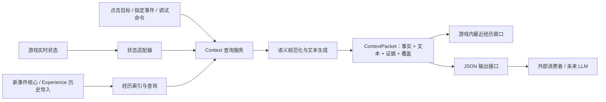

# 历史方案：当前状态 + 已记录经历的查询与输出 MVP

版本：v0.2。日期：2026-09-11。

**当前定位：历史查询方案及既有离线原型说明。** 已确认的总体方向见[三模块设计共识](modular-context-provider.md)：同一项目内解耦调试，最终全部启用，可整合为一个 MOD。本文保留原方案，具体接口和实施顺序待细化，查询入口可作为阶段验收工具。

目标是在选定游戏时刻，构建一份 Context：**当前状态由游戏即时查询，过去经历从事件与记忆层检索，两者携带时间、来源和覆盖范围；同一份结果用于游戏内展示和未来的 LLM 输入。** 当前不设计 Prompt、模型调用、生成结果或游戏效果执行。

v0.2 的采集架构建议调整为[本项目独立的事件核心](event-memory-architecture.md)。Experience 提供采集参考和历史输入；本轮既有离线原型仍读取旧格式，不代表新事件核心已经实现。

本轮完成了源码接入点核验、接口设计和一个离线历史导出原型。游戏内实时采集、鼠标菜单、悬浮提示及自动输出队列尚未实现、安装或实测。离线原型中的 `snapshot.status` 明确为 `unavailable`。

## 1. 推荐的整体实现



这样，点击查询和 LLM 出口不会分别维护两套解释逻辑。更换通知窗口、添加悬浮提示或接入模型，都消费相同的数据契约。

**这一目标不要求先还原完整历史世界状态。** 查询时直接读取现在，历史部分只回答已捕获的经历。任意历史时点的状态重建属于[另一项扩展能力](state-history-and-generated-events.md)，不作为本阶段前置条件。

建议由本仓库维护采集适配器、共享事件及查询核心，分批移植已验证的游戏入口。通过旧格式 importer 继续使用 Experience 样本；修改 Experience 的公共接口不再作为新系统的必要前置步骤。

## 2. 现有能力与需要补的部分

| 部分 | 已核验的基础 | 本阶段需要增加 |
| --- | --- | --- |
| 当前状态 | `services`、SimInfo、Sim 实例、tracker、object component 查询入口 | 目标解析、白名单字段、读取时点及字段级缺失状态 |
| 已记录经历 | Experience 的事件 JSONL、`parent_id`、target、参与者等 | 统一目标查询、去重规则、按物件实例反向索引 |
| 即时历史更新 | Experience 的 `writer.FLUSH_LISTENERS` 可接收已落盘批次 | 新核心分别发布已接收和已持久化水位，供近期查询与可靠消费 |
| 可读描述 | Web 的 `verbCN/eventPhrase/humanFields` 有初步规则 | 独立于网页的语义层、结果状态、参与角色、来源和回退规则 |
| 游戏内显示 | Experience `notify.show(title, text)` 使用 `UiDialogNotification` | “查看最近交互经历”的目标菜单与查询回调 |
| 对外提供历史 | 调试服务器有 `/api/events` 等接口，另有特定 Situation 的 LLM 证据包构建函数 | 包含实时状态的通用 ContextPacket 与输出适配器 |
| 本仓库离线原型 | 本轮新增 `preview_context.py`、文件输出与测试 | 用实际游戏 provider 替换离线数据源后完成游戏实测 |

Experience 的调试 HTTP 接口来自外部 Python 服务器，不是游戏本体 API。它已有的 `llm_memory_packages(situation_id)` 面向特定情境下的 owner→entity 记忆证据，并不等于任意目标的“实时状态 + 历史”接口。

## 3. 一份查询契约

正式游戏接入建议提供以下逻辑接口；这些名称是**本项目拟定义的接口**，不是已经存在的 EA/Experience API：

```python
build_context(request) -> ContextPacket
read_current_state(target, fields) -> StateSnapshot
query_history(target, profile, limit, cutoff) -> HistoryResult
render_history(history, locale) -> RenderedHistory
publish_context(packet) -> ExportReceipt
```

请求至少明确：

| 字段 | 含义 |
| --- | --- |
| `request_id` | 本次触发的身份；重试不产生第二个不同的逻辑请求 |
| `target.kind / target.id` | Sim 或 Object，以及实例 ID；所有身份 ID 用 JSON 字符串 |
| `scope` | 存档/分支、采集 session；离线数据只声明记录来源，不能自动认作已验证分支 |
| `perspective` | 第一版用 `player_observer`：玩家观察视角；查询目标不等于角色知识的拥有者 |
| `snapshot_fields` | 需要的当前字段；缺省使用明确的 MVP 白名单 |
| `history_profile / limit` | 最近哪种记录、多少条；窗口默认 5 条 |
| `locale` | 可读文本语言；原始 tuning/事件 ID 一并保留 |
| `trigger` | 点击查询、命令或未来触发事件；必要时关联触发事件 ID |

面向 LLM 的包不必限制为 5 条。5 条是 UI 验证窗口；后续可按玩法选择时间段、相关人物/物件、重要经历和证据预算，并报告截断。

### 3.1 当前状态的第一版范围

| 目标 | 建议首次支持的字段 | 缺失情况 |
| --- | --- | --- |
| Sim | Sim ID/名称、实例化状态、地块、游戏时间、当前主要交互、指定需求值和当前 Buff | 未实例化时保留 SimInfo 可读字段；活动/位置等实例字段标不可用 |
| Object | 实例 ID、定义/tuning、地块/可确认的库存位置、存在性、组件提供的指定状态 | 已销毁、卸载、组件不存在、未支持的状态分别表达 |
| 共同元数据 | 游戏版本、MOD/采集器版本、开始/结束采集 tick、字段清单及状态 | 部分读取失败返回部分结果，不以 0/空集合冒充实测值 |

例如区分 `observed`、`absent`、`unavailable`、`unsupported`、`error`；空 Buff 集合只有成功枚举后才能解释为“没有 Buff”。需求数值附实际 statistic、单位/范围，不默认所有需求都是 0–100。

读取使用游戏线程及允许的生命周期；避免为了查询而创建 statistic、增加 Buff 或触发交互。具体源码入口沿用[技术分类](context-acquisition-interfaces.md)，逐项登记版本、读取副作用与游戏实测状态。

### 3.2 时间一致性

在一次有界的游戏线程任务中固定查询目标、当前时钟和历史水位，读取所选状态；记录采集开始/结束 tick。耗时任务不能在网络线程中访问游戏对象。

历史水位应是适配层的单调观测序号。Experience 的事件 ID 可能提前分配给尚未结束的交互，不能把 ID 中的数字直接当作所有事件的发生顺序。若读取跨越多个 tick，包中声明读取区间，不声称是全世界原子快照。

未来 LLM 返回时状态可能已改变；此处只输出带时点的输入快照。任何结果执行仍需另行检查，但不属于本阶段实现。

## 4. “最近 5 条”必须先确定口径

第一版明确显示 **“最近 5 条交互记录”**，采用 `interaction_records_v1`：

1. 从所选来源范围中取 `did/received`，包括内部交互步骤；不将“自主选择了某行为”当成行为已完成。
2. 对相同 `event_id` 的相同内容去重；同 ID 内容冲突直接报错，避免静默覆盖。
3. 只有 `received.parent_id` 指向 `did`，且发起者和 verb 相符，才合并为一条记录的不同视角。普通因果 parent 不按此规则合并。
4. Sim 查询匹配发起者、记录参与方、明确 target 或 participants 引用；返回具体相关角色。`received` 在当前采集器中可能由参与者列表生成，不统一翻译成“被直接施加了该动作”。
5. Object 原型只匹配明确的非 Sim `target.id`，以实例区分同型号物件。`via_object`、感知来源和同场出现暂不纳入这一查询 profile。
6. 按主记录的游戏时刻倒序取 5 条，同游戏时刻用记录时间及稳定次序打破平局。这是**记录的终态时刻**，不是保证精确的活动起止区间。

源代码 `DateAndTime.day()` 是一周内的日序，绝对日序需计算 `week * 7 + day`。当前 Web 的 `tsMinutes()` 只使用 day，不能照搬为跨周排序。原型已处理 week；若任何匹配记录缺少可解析游戏时刻，整次查询改用记录时间并声明 `recorded_time_fallback`。展示中的周/日沿用源数据从 0 起的索引。

不足 5 条就展示实际条数。空结果表示“此查询范围内没有记录”，不能写成“从未发生过任何经历”。

这一步验证目标身份、历史检索和展示链路。它仍可能出现“站立”“社交位置调整”等内部动作，也不保证合并同一次交互的所有生命周期重复报告。它们都是后续语义聚合需要解决的内容，原型通过 profile 和 coverage 明确暴露。

### 后续升级为玩家意义上的“经历”

新增版本化的 `experiences_v1`：以明确交互实例为锚，关联结果、Buff/实际状态变化和 Situation，将已验证的内部步骤归入同一活动；保留未完成、失败和取消。原始记录仍可回查，过滤数量和理由随结果输出。

物件查询再增加独立关系：`direct_target`、`effect_via_object`、`perception_source`、`co_present`。例如“此物件被用作交互目标”与“此物件只是同场出现”应有不同文案。无 Sim 主体的损坏、移动或状态变化还需要额外采集，不能仅靠反查 Sim 文件保证覆盖。

## 5. 代码数据转自然语言：可以称为“语义化”

更准确地说，这里包含三项基础能力，以及一项后续能力：

| 层次 | 要解决的问题 | 例子 |
| --- | --- | --- |
| 名称/资源解析 | ID 和 tuning 指的是什么 | Sim ID → 名字；物件实例 → 名称、类型；交互 tuning → 动作标签 |
| 语义规范化 | 谁、对谁、做了什么、处于什么结果状态 | `did` 的发起者、`received` 的参与方、`user_cancel` 的取消结果 |
| 确定性文本生成 | 将已知事实表达为可读句子 | “记录到某人的练习国际象棋交互完成；目标是这张棋桌” |
| 经历摘要/解释 | 将多条事实组织成活动或意义 | “上午练习了几次棋”；好恶、原因或人物动机必须另有依据 |

前三层可以使用规则、字典、游戏名称资源和模板完成，不需要先接 LLM。最后一层可以以后采用规则或 LLM，并继续保留证据和推断标记。

以真实样本 `e-1789024209-3018` 为例：

```text
kind = did
verb = chess_practice
status = Complete
target.id = 932260978336661594

→ 记录到 Zhafira Cahyaputri 的“练习国际象棋”交互完成。
  交互目标：国际象棋桌（932260978336661594）。
```

同一模板遇到 `user_cancel` 应写“交互被取消”；遇到未知状态应保留原值并注明未确认完成。不能补写“赢了棋局”“棋艺提高了”或“心情变好了”，除非有独立结果证据。

### 5.1 不宜直接照搬现有网页汇总

Experience 的 `eventPhrase()` 主要把名字、动词和目标串联；它不充分表达所有参与视角和结果。`summarizeEvs()` 还会根据部分 `detail.amount` 汇总“状态变化”，但这些数值可能只是 Loot 配置，不能作为本项目的通用实际增量。

本项目的规则应保留以下区别：

- 记录到 Loot 配置 `amount=3`，与实际测得状态从 A 到 B 不同。
- `co_present` 只说明位置/范围关联，不证明某 Sim 看见、知道或记住了此事。
- `parent_id` 依采集器语义表示关联；普通父引用不自动证明自然语言中的因果结论。
- 交互时长、Buff 时长和 Situation 时长在当前参考实现中使用的时间基准不同，不能统一当游戏分钟。
- 名字来自当前/最近的名称目录时，不能断言它就是事件发生时的名字；历史命名需要追加时间化元数据。

### 5.2 游戏本地化对象不等于已经得到外部可用的中文字符串

`Interaction.get_name()`、`LocalizationHelperTuning.get_object_name()` 等能构建游戏使用的本地化值。`LocalizedString` 包含资源 hash 和 tokens；直接 `str(value)` 不保证得到玩家在客户端看到的文字。

游戏 UI 可以消费本地化对象；对外 JSON 则应使用可确认的 Python 名称、经版本校验的 STBL/资源映射或项目维护的释义表，并保留资源 ID、locale 和 tokens 的必要引用。外部完整的 STBL 解析及 DLC/MOD 覆盖顺序尚需实现验证。

第一版用小型释义表输出中文，未收录的词条显示“未映射交互：原始名称”。这比丢弃事件或生成一个未经核验的动作更适合检查覆盖。每条文本附 `mapper_version`、`label_source`、原始状态和 `evidence_ids`。原型释义不冒充游戏官方中文名称。

正式词条应尽可能绑定资源/tuning ID、来源版本与事件类型；旧数据只有名称时采用明确的兼容回退。不同 MOD 的同名 tuning 不能自动共享同一个语义规则。

## 6. 鼠标交互：先做点击，悬浮单独验证

### 6.1 首选的可验收路径

```text
在 Live Mode 点击 Sim / 已支持的 Object
→ 菜单“Context：最近交互记录”
→ 以被点击对象为 target 构建 ContextPacket
→ 通知窗口显示目标名、记录时间、最近最多 5 条及必要的缺口说明
```

`self.target`/被点击对象是查询对象，活动 Sim 是 UI 操作者，两者不能混用。Object Part 需按 Experience 的身份规则解析宿主；对象定义 ID 不能替代对象实例 ID。

建议增加一个即时查询交互，参考 `ImmediateSuperInteraction`，以 `.package` 中的交互 tuning + `.ts4script` 中的查询逻辑接入。它应为玩家触发，不自主运行，不要求走到目标旁边，不产生动画、物品消耗或游戏效果。具体 tuning/test 设置仍需按所用游戏版本实测。

菜单接入可沿已核验的 `ScriptObject.super_affordances()` / `potential_interactions()` 路径；在 tuning 加载完成后为支持的 Sim/Object 类幂等注册 affordance，或使用已验证的等价注入机制。不能把一个 Python 查询函数的存在等同于它已经出现在所有对象菜单中。

原型阶段先支持当前地块的 Sim 与一小组普通物件（例如棋桌、椅子、食物），覆盖新创建对象和切换地块后的注册；随后扩展库存物件和特殊目标。排除查询交互本身的经历采集，避免每查看一次历史就制造一条新“经历”。

显示可在 Context MOD 中参考 Experience 的实现封装 EA 通知 API；兼容运行时也可以复用已有的 `notify.show(title, text)`。通知拥有者可以是活动 Sim，标题与内容必须来自被查询对象。窗口内的证据链接、分页和自定义按钮不是现有 `notify.show` 已提供的能力。

开发时先增加拟定命令 `context.inspect <sim|object> <id>` 验证查询，再连接菜单。该命令尚未注册；这是下一阶段的调试入口设计。

### 6.2 悬浮提示为什么另做一个里程碑

已找到游戏入口：`ui.create_hovertip` → `target.on_hovertip_requested()`，以及 `TooltipComponent.update_tooltip_field()` 和 `TooltipFieldsComplete`。它们受既有客户端样式、字段、优先级、元数据刷新和对象组件限制。

因此可以研究在已支持的物件提示中增加短内容，但不能据此宣称任意 Sim/Object 都能出现一个自定义 5 行悬浮窗口。还需要验证 Sim 的客户端人物提示、食物/收藏等既有样式、其他 MOD 对相同字段的使用，以及游戏更新后兼容性。

悬浮内容应消费缓存；不能每次移动鼠标都扫描历史文件或发起模型调用。首先尝试“最近一条摘要 + 点击查看详情”，经过空间、刷新和兼容性验收后再考虑直接展示五条。用户提出的点击/悬浮是可选入口，点击路径可独立完成首轮验证。

“任意时刻”的首版范围是目标可解析、采集器就绪的 Live Mode。暂停中的菜单/即时显示需要实测；读档中、CAS、建造模式、对象已删除等情况返回明确不可用状态，不承诺均可点击查询。

## 7. 即时记录与历史索引

**建议的正式接入：新采集适配器提交原始观测，经事件核心关联为共享事件，立即更新有限的近期索引；持久化另有确认水位。** 各个 Sim 的视角引用共享事件，Object 查询通过实体反向索引完成。

查询需要区分已接收、尚未持久化的事件和已经确认写入的事件。事件修订、卡片与记忆投影也分别声明版本/水位，不能因异步消费者尚未处理而把旧结果当成最新。

Experience 的旧格式兼容路径仍有边界：`emit()` 将记录放入私有 `_BUFFERS`，`FLUSH_LISTENERS` 在 flush 后才收到批次，`subscribe_terminal()` 也不是完整入库事件总线。仅导入旧文件无法提供未落盘事件；这属于兼容路径的限制，不要求新采集器依赖或读取这些私有结构。

启动时按明确的存档/分支恢复近期索引。共享事件日志与来源观测是事实依据，按 Sim/物件实例建立可重建引用；卡片/记忆作为派生查询层，不替代事件存储。

历史未预热、缓冲溢出、重连、采集停用或版本不匹配时输出 `loading/partial/unavailable` 等状态与水位。历史查询不能在游戏主线程进行无界全盘扫描。后台线程只处理复制出的普通数据；游戏 API 访问、UI 通知和生命周期回调留在游戏线程。

存档回滚需要显式分支：当前 Experience 的启动槽不是可靠存档身份，旧数据不能通过导入自动补齐这一信息。新系统切换存档、读旧档或无法确认连续性时建立新分支/隔离范围；不同分支的事件不能凭同一 Sim ID 合并。身份、故障恢复与具体迁移规则见[事件核心架构建议](event-memory-architecture.md)。

## 8. 输出接口：先固定 JSON，再换传输方式

第一版输出一个 `ContextPacket`，顶层约定如下：

| 字段 | 内容 |
| --- | --- |
| `schema_version / context_id / mode` | 契约版本、一次采集包的 ID、运行或离线模式 |
| `scope / target / request` | 来源及分支、查询对象、视角与筛选口径 |
| `snapshot` | 当前状态和采集时点；离线样例明确不可用 |
| `history` | 最近记录、相关角色、自然语言、证据引用、顺序、数量与截断 |
| `evidence` | 选中记录的原始字段及来源定位；ID 转字符串以保证传输精度 |
| `coverage` | 支持范围、已观测时段、缺口、新鲜度及不能推断的内容 |

原始字段和文本一起输出：程序可以按 ID 关联/过滤，LLM 可以消费文本与结构化事实，用户也能回查一句话从哪里来。不同消费者可以做有界裁剪，但不能把文本推断重新写回事实字段。

本轮已实现的文件接口是：

```python
# tools/preview_context.py；离线函数，不能直接访问当前游戏状态
packet = build_preview(events, target_kind, target_id, source_scope,
                       names=names, limit=5, locations=locations)
write_packet(packet, output_path)
```

`write_packet` 写 UTF-8 JSON，先写同目录临时文件再替换目标，避免消费者读取半份 JSON。这是一个真实可运行的输出接口，但当前 provider 仅支持离线历史。

正式游戏接入建议先采用文件 outbox：

```text
游戏内构建普通数据包 → 有界输出队列 → outbox/<context_id>.json
外部消费者读取完整文件 → 按 context_id 去重 → 得到 ContextPacket
```

游戏线程只做有界采集/入队；磁盘输出交给不访问游戏对象的适配器。收据区分 `queued`、`written`、`failed`，未来必要时另增消费者确认。文件成功写出不代表 LLM 已消费或已生成结果。

后续可以把同一 payload 换成 localhost HTTP 或其他通道；不需要同时设计多套数据模型。当前不启动 HTTP 服务、不配置模型密钥，也不调用已有服务器的 LLM 生成功能。未来消费者只需接受 ContextPacket，本阶段无需规定它会产生什么文本或游戏事件。

## 9. 分阶段验收

| 阶段 | 可验证结果 | 验收重点 | 本轮状态 |
| --- | --- | --- | --- |
| M0：离线历史查询与语义输出 | 指定 Sim/Object 输出最近最多 5 条及证据 | ID 精度、实例隔离、关联视角、状态翻译、周边界排序、未知回退 | 已实现并用真实样本运行；13 项自动检查通过 |
| M1：游戏内命令查询 | `context.inspect` 输出实时快照和近期历史 | 目标区别于活动 Sim；未落盘事件可见；字段值与同一时点直接查询一致 | 待实现/游戏实测 |
| M2：点击查看 | Sim 与已支持 Object 的菜单可显示同一查询结果 | 正常/取消交互、少于 5 条、无记录、目标卸载、同型号不同实例；暂停可用性及窗口容纳 5 条 | 待实现/游戏实测 |
| M3：触发时自动输出 | 指定触发点写出与 UI 共用的 ContextPacket | 源版本/分支/时点明确、队列有界、文件完整、重试去重、游戏线程不等待外部消费者 | 离线文件 sink 已实现；游戏接入待实现 |
| M4：悬浮入口 | 在验证过的目标提示样式中展示缓存摘要 | 不覆盖原提示、不高频扫描、悬浮切换刷新、其他 MOD 兼容性 | 后续可选 |

最小人工场景：同一 Sim 依次使用两张同型号棋桌，完成一次、取消一次，再查询各个目标。核对窗口目标、结果状态、最近记录和原始证据。交互刚结束且尚未落盘时立即查询；切换地块及读旧档后再查，确认不会显示另一个对象或另一条分支的历史。

性能验收先记录测试机和支持的对象/记录规模，测量 p50/p95 查询耗时、读取 tick 跨度、历史延迟和输出队列长度，再设可执行阈值。本轮离线运行时间不能冒充游戏内性能结论。

## 10. 本轮可运行样例

原型只读取一个明确的 `events/<recording>/` 叶目录，不默认跨启动槽合并。它不导入或执行参考仓库代码，也不读取正在运行的游戏。

```powershell
python tools/preview_context.py --events-dir C:/sources/Sims4-Experience-Mod/win0910/events/2026-09-10T15-10-09 --names C:/sources/Sims4-Experience-Mod/win0910/names/names.json --source-scope win0910/2026-09-10T15-10-09 --target-kind sim --target-id 620677770788405884 --output docs/examples/context-sim-preview.json
```

将目标改为 Object 的命令：

```powershell
python tools/preview_context.py --events-dir C:/sources/Sims4-Experience-Mod/win0910/events/2026-09-10T15-10-09 --names C:/sources/Sims4-Experience-Mod/win0910/names/names.json --source-scope win0910/2026-09-10T15-10-09 --target-kind object --target-id 932260978336661594 --output docs/examples/context-object-preview.json
python -m unittest discover -s tests -v
```

| 输出 | 本轮结果 |
| --- | --- |
| [Sim Context 样例](examples/context-sim-preview.json) | Dave NPCAI；127 条匹配的交互记录中返回最近 5 条，包含 8 条原始视角证据 |
| [Object Context 样例](examples/context-object-preview.json) | 指定国际象棋桌；18 条直接 target 交互记录中返回最近 5 条，包含 5 条原始证据 |

输入是已审计的 `win0910` 样本，共 3,934 条事件，游戏时间约 08:00–12:11:51；这是旧版本采集样本。样例不表示一天完整历史，不提供实时状态，也没有证明整个时段无漏采。

Object 样例中尚未映射的 `Chess_Social`、`chess_setup` 会保留原名。Sim 样例保留内部交互记录，并标明本人作为另一人交互参与方的关系。这些输出用于直观看到“原始记录 → 可读经历”还需要补哪些映射和聚合规则。

测试使用独立合成数据与临时目录，覆盖与本接口正确性有关的边界；未执行 Experience 仓库可能访问真实用户数据的测试。代码保持普通标准库实现，当前验证解释器为本机 Python 3.14；游戏侧编译/兼容目标应按参考项目的 Python 3.7 工具链单独验证，不能直接把本机 `.pyc` 打包进游戏。

## 11. 本轮源码证据

基线版本见[参考资料基线](reference-baseline.md)。下列“已核验”均指源码核验，不代表新 MOD 已游戏实测。

| 结论 | 定位 |
| --- | --- |
| 已有游戏通知实现 | [Experience notify.py](../../Sims4-Experience-Mod/src/experience_recorder/notify.py)：`_show`、`show` |
| 已有网页名称与动词释义；简单汇总存在使用边界 | [Experience app.js](../../Sims4-Experience-Mod/web/app.js)：`verbCN`、`eventPhrase`、`humanFields`、`summarizeEvs`、`tsMinutes` |
| 已有历史引用查询和特定情境 LLM 证据包 | [debug_server.py](../../Sims4-Experience-Mod/tools/debug_server.py)：`entity_events`、`_event_refs`、`llm_memory_packages` |
| emit 先入缓冲，公开列表通知在落盘后执行 | [writer.py](../../Sims4-Experience-Mod/src/experience_recorder/writer.py)：`emit`、`flush`、`FLUSH_LISTENERS` |
| received 由目标归档或参与者列表生成；终态订阅不是完整事件总线 | [interaction_hook.py](../../Sims4-Experience-Mod/src/experience_recorder/hooks/interaction_hook.py)：`subscribe_terminal`、`_on_archive` |
| Sim/SimInfo、Part/宿主与对象引用规则 | [model.py](../../Sims4-Experience-Mod/src/experience_recorder/model.py)：`obj_ref`、`make_event` |
| 点击菜单的 affordance 枚举路径 | [script_object.py](../../sims4-python/ea-source/EA/simulation/objects/script_object.py)：`super_affordances`、`potential_interactions`；[interaction_commands.py](../../sims4-python/ea-source/EA/simulation/server_commands/interaction_commands.py)：`generate_choices` |
| 即时交互类型 | [immediate_interaction.py](../../sims4-python/ea-source/EA/simulation/interactions/base/immediate_interaction.py)：`ImmediateSuperInteraction` |
| 悬浮请求、字段与刷新机制 | [ui_commands.py](../../sims4-python/ea-source/EA/simulation/server_commands/ui_commands.py)：`ui_create_hovertip`；[tooltip_component.py](../../sims4-python/ea-source/EA/simulation/objects/components/tooltip_component.py)：`on_hovertip_requested`、`update_tooltip_field`；[hovertip.py](../../sims4-python/ea-source/EA/simulation/objects/hovertip.py) |
| 本地化值由 hash/token 组成 | [localization](../../sims4-python/ea-source/EA/core/sims4/localization/__init__.py)：`_create_localized_string`、`LocalizationHelperTuning`；[interaction.py](../../sims4-python/ea-source/EA/simulation/interactions/base/interaction.py)：`get_name` |
| 游戏字符串时间中的 day 为周内日序 | [date_and_time.py](../../sims4-python/ea-source/EA/simulation/date_and_time.py)：`__str__`、`day`、`week` |

## 迭代记录

| 日期 | 版本 | 变更 |
| --- | --- | --- |
| 2026-09-11 | v0.1 | 确定状态/历史双来源、点击查询优先、确定性语义化及统一输出契约；新增离线原型、两类样例与边界测试；列明游戏接入和悬浮验证的剩余工作。 |
| 2026-09-11 | v0.2 | 建议采用本仓库独立事件核心，Experience 转为采集参考与历史兼容输入；更新即时查询和持久化边界，旧离线原型保持不变。 |
