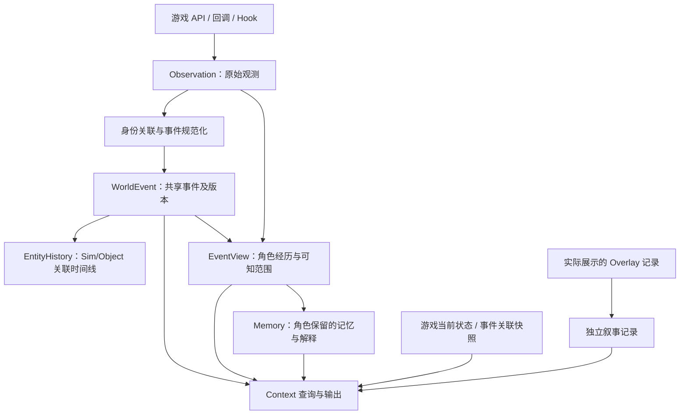

# 事件事实、实体视角与记忆：新采集系统的架构建议

版本：v0.1。日期：2026-09-11。状态：设计建议，尚未实现新的游戏采集器或冻结数据契约。

**当前定位：事件记录模块与后续记忆层的参考设计。** 事件记录已纳入获确认的[三模块设计共识](modular-context-provider.md)，内部契约由同一项目统一定义，最终三个模块全部启用；长期记忆和 Autonomy 仍属后续扩展。本文的细节需先与模块职责和独立调试要求对齐，再决定实施顺序。

## 1. 建议：在本项目重建核心，分批复用已有采集经验

建议在 Sims4-Context-for-Overlay 中建立独立的事件核心和采集适配器，参考 Experience 已验证的游戏接入点、身份解析、异常隔离和回放校验方法。Experience 的历史文件作为兼容输入及测试语料，而不是新系统唯一的数据模型或必装运行依赖。

理由是本项目要同时支持世界事件查询、Sim/Object 时间线、角色知识与记忆，以及多个 Overlay 消费者。把这些能力建立在“每条事件必须有一个 Sim 主体”的模型上，会不断补反向查询、跨 Sim 去重和例外处理。

本次建议的核心是：**同一个已确认的游戏事件有一个共享身份；不同实体与它的关系、各个 Sim 能知道的部分和后来形成的记忆分别引用它。** 采集适配器可以逐个移植，无须一开始覆盖全部游戏系统。

“客观事件合集”在这里指**已观测、带来源的事件事实层**。它仍然有范围、版本、缺失字段和采集空窗，不意味着已经掌握游戏的一切真相。

## 2. 对 Experience 当前模型的判断

Experience 已经有这一方向的基础：`did` 与 `received` 使用不同 `event_id`，但接受/参与视角通过 `parent_id` 指向发起者记录。因此它不是完全没有关联的两份日志，也不应简单判定为错误设计。

目前的问题在于，不同维度共用一个 `ExperienceEvent`：

| 当前 kind / 字段 | 实际表达的主要维度 | 新模型建议 |
| --- | --- | --- |
| `did` / `received` | 某个 Sim 在交互中的视角/角色 | 一次共享交互事件 + 多个实体角色/视角 |
| `perceived` | 某种感知/广播机制对 Sim 生效的观测 | 感知证据或独立感知事件，引用被感知的事件/刺激；不自动等于完整知情 |
| `changed` | 可能是操作调用，也可能是实际状态变化 | 区分调用、配置效果与实测状态变化 |
| `joined` | 情境成员关系的生命周期 | 情境成员加入/离开事件及成员区间 |
| `decided` | 决策过程中的选择记录 | 独立的决策事实/诊断证据，关联后续交互；不是已执行行为 |
| `parent_id` | 参与者镜像、决策关联、操作来源等多种关系 | 关系类型显式化，如 `perspective_of`、`caused_by`、`associated_with`、`part_of` |

`did/received` 本身也不是完整的主观记忆：当前 `received` 可能由参与者列表生成，里面没有完整的“理解、评价、记住了什么”。它更接近以 Sim 为中心的经历记录。

所以重构的价值不只是去掉重复正文，而是让**一次发生、多个观测、多个视角、多个记忆**各有清晰身份和语义。

## 3. 推荐分层



| 概念 | 回答的问题 | 最少应明确的信息 |
| --- | --- | --- |
| **Observation 原始观测** | 哪个接口在何时报告了什么？ | 观测 ID、采集源/版本、运行 scope、游戏 tick、观测序号、原始标识与有界 payload、调用返回/异常状态 |
| **WorldEvent 共享事件** | 一次发生中，哪些事实得到支持？ | 事件 ID/类型、参与实体与角色、生命周期、时间/结果、来源观测、相关情境/快照、字段缺失与版本 |
| **EntityHistory 实体时间线** | 哪些事件和这个实体有关？ | 实体身份、事件引用、关系类型；通常是可重建索引 |
| **EventView 经历/知识视角** | 这个 Sim 以何种方式接触事件，能使用其中哪些信息？ | owner、事件引用、角色、亲历/感知/被告知依据、可知字段范围、知情时刻、证据 |
| **Memory 记忆** | 这个 Sim 留下了什么回忆或解释？ | owner、事件/视角引用、记忆内容或 claims、涉及实体、来源类型、形成时间、规则/模型版本 |
| **StateSnapshot 状态快照** | 所选字段在某一观测时点是什么？ | 实体、字段值、读取区间、读取来源、覆盖；与历史事件分开 |
| **OverlayRecord 叙事记录** | 生成的哪些内容实际被展示了？ | 内容、来源事件、展示状态/时间、说话者与受众；不自动成为游戏事实 |

前三者围绕事实与查询，EventView 与 Memory 区分“接触过”与“如何保留/理解”。表中的概念不要求立刻对应七套独立服务或七份物理文件。

### 3.1 一次 A 与 B 的交互

假设捕获到同一次“打招呼”交互，A 是发起者、B 是明确目标：

```text
共享事件 E1
  交互：打招呼
  A：actor
  B：target / 记录中的参与方
  结果：Complete（保留原始状态和来源）
  证据：O1（发起者归档）、O2（参与者归档）

A 的经历视角 VA ──引用── E1
B 的经历视角 VB ──引用── E1

A 的记忆 MA ──引用── VA、E1 的相应版本
B 的记忆 MB ──引用── VB、E1 的相应版本
```

E1 只算一次发生。VA/VB 可以有不同可知范围，MA/MB 可以有不同摘要或解释，也可能尚未生成记忆。没有必要为每条底层内部交互强制生成一条长期记忆。

比如“A 向我打招呼”可依据事件表达；“A 想和我成为朋友”是解释，若保存，应明确为规则/模型派生内容。游戏内确实存在的 Buff、情绪值或关系变化则可作为观测事实记录，不能和模型推测的情感混写。

仅仅在旁边的 C 可以进入空间关联索引，但不因此获得对 E1 的知情记忆。应在取得感知证据、明确受众或游戏规则依据后再建立相应 EventView。

### 3.2 普通 Object 的“记忆”怎样表达

普通物件建议使用 **EntityHistory（关联事件时间线）**。例如同一张棋桌被谁使用、何时移动、何时损坏，都是事件到物件的关联查询。

“A 觉得这张棋桌令人愉快”属于 **A 的 Memory**，其中 `about_entities` 包含这张棋桌；不是棋桌自己持有的主观评价。实例 ID 与物件类型同时保留：前者用来区分两张同款棋桌，后者支持“国际象棋”主题检索。

如果某类对象有游戏定义的智能或本项目明确设计了拟人化叙事，可以为其增加认知模型。物件刻字、制造者、照片内容等已有信息则首先属于可观测物件状态，不必强行建模为心理记忆。

## 4. “一个事件”应在什么粒度上成立

### 4.1 观测去重和事件关联是两件事

- 同一 source record 被重复消费：按来源范围和观测 ID 幂等处理。
- 不同 Hook 报告同一次底层交互：根据经验证的运行时交互身份关联到一个 `event_id`。
- 两个不同交互只是演员、动词和时间接近：不能据此强行合并。

源身份至少包含存档分支、游戏运行 session，以及生产者保证唯一的交互/调用实例标识。按需要补 zone-load 或实体生命周期标识；具体作用域由适配器的游戏版本验证确定。不能把 Python `id()`、tuning ID 或没有 scope 的 interaction ID 当成跨运行永久身份。

缺少强关联依据时保留多个候选/未关联观测和不确定状态，后续补证据。事件规范化可以修订，原始来源不能被模糊时间匹配静默抹掉。

### 4.2 生命周期与后果

同一个交互 occurrence 可以只有一个稳定的 `event_id`，但经历多个阶段：

```text
interaction E1：首次观测 → running → completed / cancelled / failed
```

这些阶段更新通过追加观测/事件修订保存，再生成当前版本的事件视图。若采集到取消请求，应区分“请求调用”“调用返回/抛错”和“观察到最终终态”。若只看到终态，则开始时刻未知；退出游戏时仍在进行，结束状态也是未知。

需求变化、Buff 增删、对象创建等可以作为独立事实，显式关联 E1，不为减少事件数而塞成一个不可解释的大对象。因果引用必须有依据；仅同一情境或邻近时间只能作为关联。

两个 Sim 各自吃了一份牛排，通常对应两次吃饭交互。它们可以属于同一次共同用餐 `Episode`，但不应因叙事上是“一顿饭”就把两次底层发生去重为一个。

### 4.3 修订与可追溯性

原始观测追加保留；事件标准化结果带 `event_version`。后到证据、关联修正或规则升级可以产生新版本，影响对应索引/视角的重建。

已输出的 Context 和已形成的记忆记录当时使用的事件版本或内容摘要，并标记后续失效/修订关系。这样可以解释“当时为什么这样生成”，而不会因更新当前事件视图而改写过去模型实际见到的输入。

## 5. 值得优先改进的部分

下面针对本项目目标评估；不表示 Experience 为既有演示玩法所作的取舍全部不合理。

| 优先级 | 当前实现与影响 | 新系统建议 |
| --- | --- | --- |
| **P0：实体中立的事件核心** | `make_event/emit` 要求 `sim_id`，Loot hook 跳过非 Sim 主体；无操作者的物件变化难以自然纳入 | 参与实体采用有类型的引用，Sim 主体可选；物件/世界系统事件不虚构一个 Sim |
| **P0：发生身份与生命周期** | `did/received` 独立身份；交互主要记录终态；按状态去重不等于一次发生唯一 | 共享 occurrence ID，保留多源证据与生命周期修订；玩家取消、终态归档和重入分别关联 |
| **P0：事实精度** | Loot detail 读取操作配置；folding 部分将 amount 累加为 net_effect | 分开 `operation_observed`、`configured_effect` 和 `state_change_observed`；只有实测前后值才能作为实际增量 |
| **P0：时间与世界身份** | 启动槽不等于存档分支；交互与部分 Buff/Situation 时长使用不同时间基准 | 游戏 tick/游戏时间为行为时间轴，现实时间用于延迟；显式分支/session/采集序号、时间单位和未知字段 |
| **P0：持久化与失败恢复** | writer 在成功写入前 `popleft()`；后续序列化/写入失败时存在记录已离开缓冲的风险 | 明确 accepted 与 durable，写入确认后释放待写记录；崩溃恢复、截断尾行检测、幂等重放和可观测缺口 |
| **P1：关系和并行情境** | `parent_id` 多义；每 Sim 的 `CURRENT_CONTAINER` 只有一个主锚点 | 使用带类型的关系边与情境成员区间，允许同时关联多个 Situation；主要情境是查询策略 |
| **P1：采集过滤与展示分离** | 黑名单在落盘前删除；短现实时间窗可同时吞掉不同的真实调用；inert 也包含基于类型的推定 | 区分采集范围、传输去重和展示筛选；按调用身份处理重入，未知结果保持未知，不能把类名推定当逐条实测 |
| **P1：投影和语义版本** | 卡片服务于印象聚合，证据有上限；语义规则分布在 folding、object_tags、Web/剧本逻辑 | 卡片/时间线/文本是可版本化重建的消费者；记录来源、规则版本、可回查事件引用 |
| **P1：采集内核与消费者边界** | writer 含多个归因全局表；落盘监听承接折叠；仓库同时包括剧本、调试和叙事能力 | 核心仅做安全观测、规范化、持久化与查询；记忆、Overlay、演示剧本分别订阅，消费者错误不回传影响游戏逻辑 |

保留 Experience 的两个重要优点：**观察者异常不应改变原函数行为**，以及**纯函数折叠与离线重放使用同一套规则**。重新组织后仍应维持这些纪律。

另外，当前 `injector.wrap()` 在 `finally` 调用 after，向 after 传入的 `result=None` 不能区分原函数正常返回 None 和抛出异常。新适配器应显式传递调用完成/异常状态，原异常照常传播。若包装生成器，也应按目标协议验证迭代、异常与关闭行为。

## 6. 存储与接口建议

### 6.1 逻辑统一，不要求单个无限大的文件

采用“按世界分支/session 分段的追加日志 + 可重建索引”。实体历史可以建立 Sim/Object 的反向索引，但事实身份不归属某个 Sim 文件。

第一版建议让游戏内适配器保持轻量，维护有限近期缓存和输出队列；持久化普通数据记录。完整检索、SQLite 索引和记忆重建可放在外部工具中，游戏内最近五条查询从有界缓存读取，不依赖每次扫描历史文件。

可定义以下新接口，名称尚未冻结：

```text
observe(record)                        → observation_id
get_event(event_id, version)           → 共享事件及证据
list_entity_events(entity, query)      → 关联事件与关系类型
get_event_view(sim, event_id, as_of)    → 该角色可用的信息
query_memories(sim, query, as_of)       → 该角色保留的记忆
read_current_state(target, fields)     → 当前状态快照
build_context(request)                → ContextPacket
```

游戏内“刚结束就查询”可以使用已接收、尚未持久化的数据，但结果携带状态和水位；不能宣称这些记录已经耐久保存。持久化消费者按观测/修订 ID 幂等处理，承认重试可能再次送达。

### 6.2 角色知识不能只由事件表推导

`player_observer` Context 可以读取授权范围内的共享事实；`sim_view` Context 通过该 Sim 的 EventView/Memory 过滤后返回，不直接暴露全局事件正文。

需要区分事件发生时间与角色知情时间。例如 B 第二天才被告知前一天发生的事，查询第一天 B 当时知道什么时，不能使用第二天的记忆。视角还应能限制字段：知道有人来访，不等于知道对方隐藏的需求值或真实决策原因。

数据模型应强制保留 owner/视角来源；“主观程度”“遗忘”“记忆可靠性”等更复杂机制可以后续加入，无需第一版全做。

### 6.3 采集预算与覆盖

不把“事实为先”解释成永久保存所有 Python 调用。先规定实体、地块、事件类型和版本范围，为高频信号选择聚合/采样策略，记录策略版本及损失边界。

进入持久事实层的所选事件应可追溯；展示层的噪声过滤和故事重要性评分不改变这些事实。原始观测如有保留期，应记录归档/不可回查状态，避免留下看似完整但实际失效的证据链接。

## 7. 对 Experience 的迁移与复用

| 内容 | 建议处理 |
| --- | --- |
| 游戏 API/GSI/Hook 接入知识、版本兼容经验 | 分批迁移为新 collector adapter，逐项做游戏实测 |
| Sim/SimInfo 与 Object Part/宿主解析 | 复用已核验规则；同时保留部件引用和实体生命周期信息 |
| 原始 JSONL、健康数据和审计样本 | 作为 legacy importer 输入及回放语料，注明原采集版本与范围 |
| did/received 的关系 | 明确 `parent + actor + verb` 等强依据时关联到同一候选事件；不支持的生命周期合并保留未知 |
| Loot 配置、截断参与者、混合时间单位 | 保留来源含义和缺口；导入不能补造实际变化、完整参与者或起止时刻 |
| 印象卡与 object_tags 规则 | 作为可选派生消费者重新适配，不作为共享事件的唯一事实来源 |
| 演示剧本与 LLM 调用 | 留在消费者/应用层；初版采集器不包含游戏行为回写 |

旧 `event_id` 在导入后保留为带 source scope 的来源记录 ID；新的共享 `event_id` 由规范化层管理，不能默认二者含义一致。无法关联的旧记录以 incomplete / unresolved 形式保存。

本仓库已有 `preview_context.py` 仍是读取旧格式的离线原型，不是新规范事件账本。其已有样例和检查可以保留，用来验证导入前后事实和角色关系是否一致。

新旧采集器并行对照时，应为每个 source 指定身份和比较范围。默认每类事实只有一个权威生产路径；如需同时读取多源，则通过明确关联规则处理，不能把两套采集输出直接混成两次发生。

## 8. 最小落地顺序与验收

1. **先固定一个窄数据契约。** 用“一次 A→B 交互”“两次同名交互”“一个物件独立状态变化”做样例，明确观测、事件、视角和记忆引用。
2. **实现纯数据核心与 legacy importer。** 验证观测幂等、多源关联、事件修订和实体索引；尚不接游戏也能发现身份/关系错误。
3. **移植交互采集适配器。** 先覆盖当前地块的少量 Sim/Object，验证开始/终态/取消，和直接读取的当前状态一起输出 Context。
4. **接入实体查询与展示。** Sim/Object 最近五条来自同一事件核心；先完成命令、点击和 JSON 输出，再扩展 UI。
5. **增加 EventView 与简单记忆投影。** 首批仅做有依据的亲历视角和确定性摘要；随后加入感知、被告知和其他事件类型。

关键验收应包含：

- 一个共享交互从两种参与者视角被报告，得到 1 个事件、2 个角色视角；世界统计一次，个人经历各有入口。
- A 在很短时间内对 B 连续执行两次相同交互，仍得到 2 个事件。
- 有取消请求但原调用抛错，不能记成已成功取消；结果缺失时保留未知。
- 没有 Sim 主体的物件状态变化可独立保存，并被该物件时间线查到。
- C 只是同场出现，不进入 C 的已知经历；A 对物件的记忆不成为物件自身的主观记忆。
- 重启重放或重复投递不重复计数；写入失败、半条尾记录和消费者异常都有可验证行为。
- 读旧档后产生独立分支；角色第二天才得知的事实不会泄露到第一天的角色 Context。

本轮只形成架构建议并调整实施文档；上述新核心和验收用例尚未实现/运行。既有离线原型的 13 项检查仅覆盖其旧格式查询能力。

## 9. 本轮依据

以[参考基线](reference-baseline.md)中的本地源码为准，未拉取远端、未修改 Experience。

| 结论 | 源码定位 |
| --- | --- |
| 事件要求 Sim 主体 | [model.py](../../Sims4-Experience-Mod/src/experience_recorder/model.py)：`make_event`；[writer.py](../../Sims4-Experience-Mod/src/experience_recorder/writer.py)：`emit` |
| did/received 来源与关联、终态/取消采集、最近决策关联 | [interaction_hook.py](../../Sims4-Experience-Mod/src/experience_recorder/hooks/interaction_hook.py)：`_on_archive`、`_parent_for`、`_after_cancel`、`_duration` |
| Loot 配置、非 Sim 主体过滤、现实时间窗去重 | [loot_hook.py](../../Sims4-Experience-Mod/src/experience_recorder/hooks/loot_hook.py)：`_op_summary`、`_on_op_applied` |
| 卡片 owner/net_effect 与里程碑归因 | [folding.py](../../Sims4-Experience-Mod/src/experience_recorder/folding.py)：`new_card`、`fold_event` |
| 情境单一主锚点和时间单位 | [situation_hook.py](../../Sims4-Experience-Mod/src/experience_recorder/hooks/situation_hook.py)：`_on_add`、`_on_remove` |
| 采集前过滤与类型推定 inert | [filters.py](../../Sims4-Experience-Mod/src/experience_recorder/filters.py)：黑名单、`loot_list_inert` |
| 缓冲/落盘顺序、启动槽、共享归因表 | [writer.py](../../Sims4-Experience-Mod/src/experience_recorder/writer.py)：`begin_launch`、`emit`、`flush` 及模块级状态 |
| 原函数行为隔离及 after 的异常信息限制 | [injector.py](../../Sims4-Experience-Mod/src/experience_recorder/injector.py)：`observe`、`wrap`、`wrap_generator` |

## 迭代记录

| 日期 | 版本 | 变更 |
| --- | --- | --- |
| 2026-09-11 | v0.1 | 提出独立事件核心、原始观测/共享事件/实体视角/记忆分层，明确 Object 时间线、重构优先级、兼容输入和分阶段验收。 |
