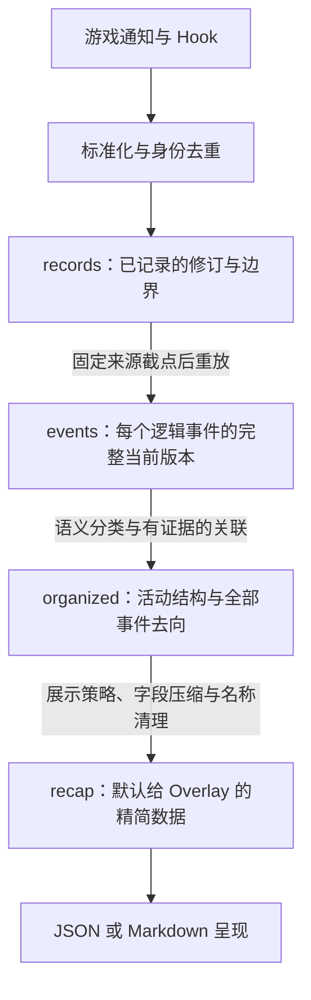

# 短版经历回顾：实施与验收计划

本文保留 2026-09-18 的实施计划和历史基线，已完成部分不再作为待办：当时短版为 `experience_recap_v1_1`，默认 JSON 为 8,992–9,807 token。第 1–7 节记录初始方案，第 8 节记录分层接口设计依据。四层接口及自动文件导出已实现，当前可调用契约及限制以[分层查询文档](event-views.md)为准，最新实机及回归结论见[验证摘要](validation.md)。下文版本、计数和“下一步”均属于当时上下文。

目标：让每个人物的默认输入能清楚回答“这段时间做了什么、发生了什么结果、关系和感受有什么变化、哪些事情尚未结束”，同时允许按需展开具体事实和原始证据。先在现有离线组织器上完成，再根据样例效果确定 Overlay 的接入方式。

## 1. 基线与优先顺序

代码基线为 `zixuan/offline-experience-views` 的 `8364d2e`，组织规则为 `experience_view_v1_1`。沿用完整日志上关联、再按人物投影的流程。

本次直接读取上一轮四份 `consumer_packet`，用 `tiktoken 0.12.0 / o200k_base` 计数紧凑 JSON。按固定顺序移除字段，记录每次整包 token 差值；下表各项互不重复并与总数相等。分词边界使归因略受移除顺序影响，不能当作每类信息固有的成本。

| 输出部分 | Eddie | Ava | Nyssa | Lila |
| --- | ---: | ---: | ---: | ---: |
| 活动内决策与评分 | 19,074 | 21,803 | 20,874 | 20,773 |
| 活动结果明细 | 8,170 | 11,259 | 11,552 | 10,261 |
| 感受与情绪区间 | 3,713 | 2,767 | 2,737 | 1,908 |
| 背景明细 | 6,215 | 5,626 | 7,150 | 5,138 |
| 未归属决策 | 4,124 | 4,649 | 2,952 | 4,335 |
| 独立事实 | 1,572 | 1,174 | 1,552 | 1,460 |
| 活动其余字段，含话题、时间、角色和引用 | 9,028 | 11,318 | 9,727 | 10,560 |
| 范围、实体字典及包结构 | 768 | 694 | 721 | 719 |
| **总计** | **52,664** | **59,290** | **57,265** | **55,154** |

决策与评分共占 41.6%–45.5%。移走所有决策和背景后仍有 23,251–27,212 token，因此实施顺序是：评分下沉 → 活动与结果简述 → 状态变化提炼 → 检查常规动作的呈现密度。

独立测量显示，所有 `evidence` 字段合计占约 4,345–5,131 token。这与上表各部分重叠，不能再次相加；默认层改用回顾条目引用，完整证据列表放入详情，可减少重复传输。

历史样本约为游戏第二天 07:26 至第三天 07:00，应称为“采集时段回顾”。第一版以完整采集时段为范围，显式标注起止与结束时仍未闭合的活动；按日历日切片留到接入前再定，不把这个样本称作完整的一天。

复现资料：

- [体积分解数据](C:/sources/Sims4-Context-for-Overlay/.local/analysis/2026-09-18-recap-plan/budget-profile.json)
- [测量脚本](C:/sources/Sims4-Context-for-Overlay/.local/analysis/2026-09-18-recap-plan/measure_budget.py)，使用本机 bundled Python 3.12 运行。
- [上一轮四人物报告](C:/sources/Sims4-Context-for-Overlay/.local/analysis/2026-09-17-cross/report.md)

## 2. 输出设计

提供两个阅读层级。第一版使用确定性结构与模板，从已有事实生成 JSON 和对应的中文 Markdown；同一事实只做一次选择，两个输出共用结果。

| 层级 | 内容 | 用途 |
| --- | --- | --- |
| 默认短版 | 时段与覆盖范围；简述的活动和重要结果；关系、知识、特征与感受变化；未闭合活动及有意义的尝试；少量完整性提示；条目引用 | 供 Overlay 初始输入或人工快速阅读 |
| 按需详情 | 组成活动、执行边界、局部数值观测、评分与候选、状态区间、归并依据、原事件及修订 | 解释“依据是什么”“为何这样归并”“具体发生了哪些变化” |

短版条目建议包含：时间或时段、主体和必要参与者、简述、执行状态、结果、可选的关联条目、详情引用。字段为设计草案，实现时以样例可读性和实际体积确定，不把 tuning 名、重复角色数组和完整证据列表放进每条简述。

初步目标为每人物每采集时段 **3,000–8,000 token**，以完整默认 JSON（含范围、提示、实体和引用）实测，另报 Markdown 和详情体积。它是试验目标，不是硬截断线，也不要求固定经历条数。超出目标时给出贡献最大的部分及其保留原因。

## 3. 保留、下沉与归并规则

| 信息 | 默认层的处理 | 必须守住的边界 |
| --- | --- | --- |
| 已开始活动 | 第一版逐项保留简述；没有特别结果的常规动作可在后续以次数和时间清单合并显示 | 显示分组保留独立实例；不能把相邻时间当作同一次活动的依据 |
| 成品、品质、付款、技能等级、愿望完成、特征及关系变化 | 优先保留；有明确原因时挂在对应活动，无明确原因时独立列出 | §3 付款、差品质成品等具体结果不能只写成“做了饭” |
| 制作与食用 | 分别陈述，记录为同一产物实例时建立引用 | 不把制作和吃饭变成一个连续活动；中断后恢复也保留实际边界 |
| 未开始或开始未观测到的尝试 | 明确用户请求、有代价、失败或后续影响的尝试保留；纯排队和重复选择可下沉并说明数量 | 提交接受不等于执行；缺失开始证据不自动等同“确定未发生” |
| 结束、取消与未闭合 | 保留“已做过后取消”“仅提交”“截至采集结束未见结束”等区别 | `SUCCESS` 不证明看完电影；缺少结束记录不证明之后一直持续 |
| 感受和情绪 | 呈现有语义的感受及已确认的状态转折；与活动存在明确证据关联时引用，否则独立列出 | 不根据时间邻近补造心理原因；不把评分写成内心独白 |
| 数值变化 | 明确付款、等级等结果直接呈现；需求等高频数值先下沉，有必要时用带时间的局部观测简述 | 不把稀疏采样相加或写成全天净变化；不能机械用首尾值替代完整观测 |
| 社交话题与他人信息 | 有语义的争论、获知内容与方向保留；普通聊天步骤压缩为简述 | 不同主体分别投影；事件索引中的人不自动被当作参与、目睹或知情者 |
| 决策、评分、候选与技术字段 | 默认下沉；用户询问动机时展开引擎证据 | 先保留来源和缺失说明，不用候选概率编造人物动机 |
| 背景与重复维护 | 已确认的维护细节下沉；影响理解的地点、环境或持续状态按需简述 | 未验证资源不得因隐藏、名称相似或高频而直接判为噪音 |
| 未知资源与待核查内容 | 显示数量、类别及回查入口；无法解释的主要行动或结果显式标为待核查 | 不能把“没有进入短版”包装成“已经确认没有重要遗漏” |

短版选择另存一份去向表：每个现有组织单元标记为“直接呈现、分组呈现、按需详情、待核查或外部来源”，并关联短版条目及规则原因。它用于检查变化，不塞进默认输入。外部 Overlay 内容继续保留来源边界，不当作游戏内事实。

## 4. 回查协议

当前已有 unit ID、`audit.evidence` 和原事件 revision，可作为回查基础，但 `e123` 只在对应输出中有意义。历史四份对照 JSON 由 `build_experiences` 生成，未携带 `analyze` 的 `source` 字段，不能假定所有现有文件都自带来源清单。

实现时增加不可变的来源清单，并形成快照标识，绑定日志 SHA256、session、人物范围、采集边界、组织规则版本、资源映射哈希和短版版本。历史样例通过已核验日志及验收文件补齐，来源无法验证时明确拒绝生成可回查包。

短版使用“快照标识＋条目 ID”；详情解析依次返回组成 unit、原事件 ID、revision 和归并依据。若需要短证据编号，必须附着于同一快照。日志增长、事件修订或规则变化形成新的快照，不复用旧编号解释新内容。

首轮只需要离线查询能力：给定快照和条目，获取摘要依据、决策或原始事件。详情较大时显式分页或按 facet 展开，不能静默截断；跨快照误用引用、来源缺失和修订不符必须明确报错。现有 `consumer_packet`、`organized` 和 `audit` 保留兼容，新短版作为独立输出。

## 5. 实施顺序与交付

| 阶段 | 工作与交付 | 进入下一阶段的依据 |
| --- | --- | --- |
| 0：基线，已完成 | 四人物体积分解；确认短编号和来源清单的限制 | 测量可复现，明确首先减少评分展开 |
| 1：最小短版及回查 | 建议新增 `scripts/experience_recap.py`，共用现有组织结果；同时完成 JSON、Markdown、来源清单、条目去向表和离线详情查询 | 四个人物均可生成，条目能回到正确来源；先建立保守完整的版本 |
| 2：按样本迭代 | 压缩结果表达、状态与常规动作；对照四人物及上一轮实机固定样本，输出前后对照和体积变化 | 固定经历检查没有退步；发现遗漏就修改一般规则并检查其他人物 |
| 3：阅读验收 | 提供四份短版及少量有争议的展开示例，并标明已知缺口 | 用户能指出漏掉的重要经历、残留噪音和过度总结；将反馈转成可复现案例 |
| 4：短程实机验收 | 用隔离测试环境和 computer use 观察实际活动，冻结日志后生成四人短版，对照观察并恢复环境 | 提交与执行、做过后取消、同物件多人物及未闭合活动均表达正确；留存验证与恢复结果 |
| 5：确定接入边界 | 根据默认体积、展开频率和用户反馈，提出 Overlay 初始输入及取详情方式 | 再决定按需查询、日历窗口与增量更新，不在短版尚未验收时冻结接口 |

阶段 1 的文件划分是建议，实现时尽量复用现有索引；只在确有职责分离需要时拆出查询模块。新增测试覆盖选择与引用的风险，不复刻每行模板文本。

用户参与点集中在阶段 3 的具体样例阅读。技术基线、保留规则的保守初值和检查可以先推进，当前没有需要用户先安装、合并或选择模型的前置动作。

## 6. 验收标准

自动检查与人工阅读分别记录，不把已知样例全部通过称为总体召回率。

- 沿用上一轮 33 条固定经历／知识检查、10 项结果与产物关联检查和 9 项实机检查，增加短版呈现预期。关键经历不能只因为原证据仍在详情就被判作短版验收通过。
- Eddie 的 75 条人工证据继续可回查；原有人工 21 段只是对照材料，不是条数目标。
- 每条短版事实都有对应证据；每个组织单元都有可解释的去向。相同输入和规则输出确定；跨快照引用和错人物引用会失败。
- 专门验证取消不抹除已发生、提交不冒充开始、电影根结果不冒充看完、未结束不补造结局、知识方向不反转、局部数值不冒充净变化。
- 四人物分别统计 token、已开始活动覆盖、保护结果覆盖、下沉项及原因、待核查项。只报告固定检查集上的通过情况，不给未经独立标注的“总体保留率”。
- 按最终改动运行相称的专项测试和必要回归；项目兼容性使用 Python 3.7，token 测量使用本机 Python 3.12。通过后不无理由重复全量检查。

人工验收重点：能否快速了解经历；是否漏掉付款、成品、争论、特征变化等值得记住的事；是否仍被常规步骤淹没；是否产生原日志没有的原因或结局；点开详情能否回答实际疑问。对疑问在四人物之间交叉检查，避免只修好 Eddie。

新实机轮只针对短版表达最容易失真的边界做观察。复用现有测试环境与恢复流程，不更改原始存档；分别记录脚本安排的行为和自主行为。截图是离散观察，精确起止仍以日志为依据。若出现与旧样本不同的行为，保留为新案例而不是修改预期以求通过。

## 7. 本轮完成条件与后续判断

下一轮的交付为四份可读短版、可展开详情、来源及去向记录、对照验收报告和实机复核结果。机械引用检查和保护样例须通过；人工发现的重大遗漏或推断错误须处理。体积未达到试验目标时明确解释原因，再决定改进表达还是调整预算。

运行时采集、在线接口和安装流程不在当前短版实施范围。离线工具与文档无需重新构建游戏包；如后续确实改到运行时，按项目约定检查、校验 manifest 并通过现有安装器部署，游戏运行中不替换脚本。不制作 ZIP，不新开 PR 或 merge。

主要不确定性是重要性感受因人而异、未知资源尚未解释，以及单一家庭样本的覆盖有限。通过具体阅读样例和新增实机观察逐步收敛；3–8 千 token 的可达性将在阶段 2 实测，不在计划阶段承诺。

## 8. 下一版：面向游戏内 MOD／SDK 的分阶段查询

用户于 2026-09-18 明确要求下游可以分别查询完整原始数据、归并后的数据和最终清理后的数据，并确认 Overlay 优先通过游戏内 MOD 实现。因此分层能力进入 MOD 和 SDK，离线工具共用处理核心验证；游戏外进程不作为首轮运行前提。以下为下一版设计，函数名及版本号在实施时确定。

### 8.1 当前真实数据流与尚缺的边界

1. **捕获与标准化**：游戏原生通知、排队／生命周期 Hook、Buff 与 Loot 等方法 Hook，以及 Autonomy 选择入口提供证据。`ea_adapter` 读取实际实例身份、角色、游戏时间、名称 hash／token 等，转换成普通 JSON。采集有明确范围与预算，不是全游戏调用追踪；未采集的通知、被采集策略排除的计时器、未保存的完整候选池不能事后恢复。
2. **身份去重与事件修订**：`Recorder` 用 session、zone_visit、actor、interaction instance 识别交互。排队、开始、退出更新同一 event_id 的 revision，多个来源的有效观察保留在 observations；同一交互内重复的 phase＋source 不再次记入。关系等事件还有针对具体操作／状态的去重。同名同分钟的两个实例不因此成为重复。
3. **日志与最新事件**：日志追加各次被接受的修订及会话／地块边界；内存索引保留逻辑事件的当前版本。`read_journal(..., event_scope="all")` 重放为每个事件最后一版，并不返回全部旧修订。磁盘日志与当前内存 FIFO 保留范围不同，已接收序号与已持久化序号也不同。
4. **语义分类与组织**：现有 `filter_events` 识别有依据的维护细节；`experience_policy` 分类；`experience_view` 在完整来源上依据 parent、cause、provider 实例建立关联，归并同族执行步骤、组织事实与状态区间，然后按人物投影并补依赖上下文。当前筛选、归并和字段压缩分散在这一过程内，`organized` 还不是一个独立的“合并完成但未清理”的公共层。
5. **选择、压缩与名称清理**：`experience_recap` 选择默认呈现项，评分与高频数值下沉，关系数值保留局部变化次数，状态按资源分组但保持独立区间。名称模块保留原解析状态并提供经过核验的释义。JSON 和 Markdown 共用结果，不涉及 LLM 总结；Markdown 是呈现形式，不是另一种事实层。

当前 SDK 的 `query_history(..., include_internal=True, group_effects=False)` 可以读取保留范围内的原事件最新修订；`group_effects=True` 只把明确关联的效果挂在同一查询结果内的动作下，不等于完整经历归并。当前离线 bundle 的 `raw` facet 对应原事件最新修订，`units` 对应组织单元，`labels/evidence/links/decisions` 提供解释。完整修订历史、独立的未清理组织层和游戏内 recap 查询仍需新增。

### 8.2 四个稳定的数据视图



四层均可独立查询，后层不覆盖前层。保持一份权威来源和可回查引用，避免永久复制四份完整 payload。

| `view` | 返回什么 | 完整性与主要用途 |
| --- | --- | --- |
| `records` | 采集器实际保存的日志记录：各次事件修订、相关观察、诊断及 session／visit 边界 | 用于分析排队→开始→退出的证据演变。它是采集器原始记录，不是未经处理的 EA 回调或全游戏录像。重试写入的相同 sequence 与真实新修订需区分。 |
| `events` | 给定来源截点下，每个 event_id 的最新完整修订，包括原字段、名称证据、角色、来源和技术事件 | 下游自行分类、归并、总结的主要入口。新接口默认保留内部事件；任何显式查询筛选必须写进 scope。 |
| `organized` | 有明确依据的活动／步骤结构、话题、结果、状态区间、关系与决策关联；未归并事件及维护／未知／外部事件的独立入口 | 允许下游采用不同的展示策略。每个输入事件必须有成员关系或独立保留位置，不能仅因“常规／内部／未知”而消失。原字段通过同一快照下的 events／records 取得。 |
| `recap` | 类似当前 Eddie 的清理结果：主体、队列与执行边界、活动、结果、感受、关系观测和质量提示 | 默认 Overlay 输入。展示 profile 决定哪些项显示、分组或下沉；所有选择均有可查询的去向及规则依据。 |

不为“中文翻译”“隐藏字段”“字符串格式”等每一步增加独立公共数据层。分类结果、筛选原因和字段压缩说明作为解释 facet 提供；必要时下游可在 events 上按这些注解查询。这样保持灵活性，同时不要求 SDK 消费者依赖当前脚本内部函数顺序。

### 8.3 区分五种处理

| 处理 | 含义 | 不能混淆的边界 |
| --- | --- | --- |
| 去重 | 同一身份／同一通知的重复接收，或同一逻辑事件的多个修订 | 不按时间相近、中文名称相同、目标相同删除不同实例。修订历史仍可查。 |
| 归并 | 不同事件有明确父子、cause、provider 等关系，组织成一个结构 | 保留成员和连接依据；制作与食用分别保留，通过产物关联；一个事件可被多个视角引用。 |
| 筛选 | 在指定视图与 profile 下决定默认显示什么 | 只改变当前视图，不能从 records／events 中删除证据。未知语义不自动等于噪音。 |
| 压缩 | 减少重复字段、评分展开及重复文字，使用引用、默认值和显示分组 | 不丢失主体、方向、队列／开始／退出区别；采样或省略必须说明可展开位置与数量。 |
| 名称清理 | 解析已记录名称；对精确资源提供已核验的释义或标记缺口 | 保存 observed name、status、tuning 和来源；中文释义不等于官方显示名，不补猜缺失的参数。 |

### 8.4 SDK 查询与跨层回查

拟新增一组 SDK 方法，继续沿用现有 API 的 session 校验、JSON 返回值和页游标纪律；不改变 `query_history` 的现有默认值，也不把 `representation="raw"` 或 `group_effects` 偷换成新层级。

```python
# 以下为拟议调用形状，当前尚不能调用。
request = client.query_event_view(
    view="recap", kind="sim", identifier=eddie_id,
    source="durable_session", profile="recap_v1",
    expected_session_id=session_id,
)

# 数据已缓存时返回 ready；首次构建可能返回 building 和 request_id。
# 从游戏回调在后续时刻查询状态，不在游戏线程循环等待。
status = client.get_event_view_status(request_id, expected_session_id=session_id)

# 用同一个来源截点查看另一层，保证不是拿新的原事件解释旧摘要。
organized = client.query_event_view(
    view="organized", source_snapshot_id=source_snapshot_id,
    kind="sim", identifier=eddie_id,
    expected_session_id=session_id,
)

explanation = client.explain_event_view(
    snapshot_id=view_snapshot_id, item_id=item_id, facet="lineage",
    expected_session_id=session_id,
)
```

首轮同时提供页面读取与关闭／取消方法。大结果分页，不在 SDK 中自动展开整段历史。`building`、`ready`、`failed` 区分；取消构建／过期时释放资源，无法满足预算时明确失败，不返回看似完整的截断结果。

统一响应至少包括：

- `view`、视图 schema 版本、session 和 `source_snapshot_id`；来源截点 `as_of_sequence`、持久化边界、来源／保留范围、数据完整性与新鲜度。
- `snapshot_id`：绑定来源截点、查询范围、归并规则、显示 profile、名称规则及输出版本。`records/events` 不因纯显示策略变化而改变事实内容。
- `items`、条目稳定标识、排序／过滤条件、`total_matches`、`next_cursor`；有界快照的生命周期和关闭方式。
- `coverage`：未观测边界、采集错误／淘汰、缺依赖、未解释名称或资源、源内筛选和视图省略分别报告。

跨层解释提供 `lineage`（成员与关联）、`policy`（分类／去向／压缩）、`labels`（名称依据）和 `revisions`（修订链）。现有 `decisions` 继续表示游戏 Autonomy 的决策证据，不能混用为清理规则的决定。

机器主键使用 event_id／unit_id 和来源／视图快照；`r54` 等短编号只用于同一展示快照内阅读。一次源事件可以属于多个组织或人物视角，不强制一对一映射；视图规则变化后不能仅靠相同短编号比较版本。

### 8.5 游戏内运行、来源完整性与范围

**首轮默认以本 session 已持久化日志的固定截点构建完整分层视图**，避免内存 FIFO 淘汰后，所谓“完整原始数据”实际只剩最近部分。当前日志不因 FIFO 裁剪，适合作为此来源。响应公布已接收与已持久化序号，说明视图可能暂时落后于实时游戏。已有实时 history 接口继续可用。

如增加 `live_retained` 来源，必须显式标记仅覆盖当前保留事件；它不能悄悄替代 `durable_session`。来源或旧快照不可用时返回明确错误，不能拿后来的 revision 补成旧快照。跨 session 历史初期继续由离线工具处理，不因存档名相同自动拼接。

公共方法仍从游戏线程调用；游戏对象读取只在游戏线程。来源重放、索引准备与视图构建使用有预算的分批任务及缓存，禁止每个 SDK 查询重新遍历整个会话。可以移至工作线程的部分仅限已冻结的普通数据或只读日志操作；禁止在那里访问 Sim、resolver、游戏服务或修改 Recorder。

提取共享 Python 3.7 处理核心进入 `src/context_overlay`，由游戏内视图提供者和离线 CLI 共用。规则资源必须随脚本包提供并通过包资源加载，不能照搬当前 `Path(__file__).with_name(...)` 读取工作区文件的方式。构建清单校验规则资源哈希；不把 tiktoken、桌面工具或模型调用引入游戏运行依赖。

**先在来源上维护完整关系索引，再按人物／时间投影。** 可以利用索引减少计算量，但不能先把另一位人物的 cause／provider／产物事件删掉。补入的范围外依赖须明确标作 supporting context。实体索引匹配与 actor／target／participant 匹配需区分，索引相关不等于参与或知情。

时间查询必须说明采用首次观测、入队、执行起止还是区间相交。不能仅按活动开始落在窗口内筛选而漏掉跨窗口活动；缺开始／结束时保留未知边界，不补造全天持续或空闲。第一版若不支持某种窗口语义，明确拒绝该参数。

首轮以可复现的固定快照及分页为验收单位，内部用源修订失效相关缓存。派生视图的增量协议另行定义：一次源修订可能改变既有活动成员、关系和显示条目，需要替换／移除语义，不能直接把 `read_event_changes` 当作 recap 增量。

### 8.6 实施顺序与验收

1. 从现有离线代码提取共享核心，区分结构组织、展示选择、名称清理和渲染；当前 Eddie 默认版作为回归基线。
2. 建立游戏内来源快照与分批构建机制，提供 records／events 的 SDK 分页、修订链及状态查询，核验磁盘截点和内存保留范围差异。
3. 补齐 organized 的成员与未归并事件入口，使全部输入事件都有可追踪去向；新增 policy／lineage 查询。
4. 将当前 recap 作为默认 profile 接入 SDK，开放同源跨层查询和解释；保留未开始、取消、缺参数与范围外依赖的表达。
5. 检查资源打包、API／SDK 版本和能力声明，做游戏内调用及负载验收。按项目约定构建、安装并验证，不默认制作 ZIP。

验收至少包括：

- 用 Eddie r54 从 recap 回查 organized 成员，再定位实例 5941 的 events 及全部 records 修订；19:25 入队与 19:33 开始在各层一致。
- r18／r19 不合并；做饭与吃饭仍分开；同物件不同人物、已执行后取消、未见结束不变。
- records 截点重放得到 events；organized 每个输入 event 都有成员或独立保留位置；recap 每项都有来源和处理依据。显示 profile 变化不改写前两层。
- 旧修订／跨快照／跨人物引用被拒绝或明确标示；源追加时已有分页不漂移；固定来源的离线和游戏内输出一致。
- FIFO 淘汰后，retained 与 durable 来源的完整性说明正确；损坏、缺序号、冲突修订或资源缺失不能静默降级。
- 并发查询、构建取消、预算拒绝、正常旅行及新 session 的状态边界正确。实测查询／构建对游戏帧时间的影响，再确定预算，不先承诺无延迟。

首轮交付是能在游戏内 SDK 独立查询、交叉回查的四层数据和相应样例；不是仅把四个离线文件命名后交给消费者自行连接。
