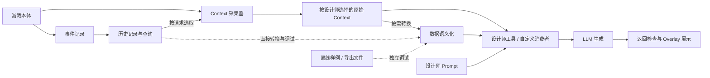

# Sims4-Context-for-Overlay：三模块设计共识

版本：v0.2。日期：2026-09-11。状态：总体方向已确认；具体 schema、目录结构、打包方式和实现细节待细化。

## 1. 已确认的目标与组织方式

项目采用三个功能模块：**事件记录、Context 采集器、数据语义化**。它们分别负责过去发生了什么、当前状态是什么、如何把已知数据表达成可读语言。最终向设计师提供可发现、可选择和可筛选的数据来源，用于自定义 Prompt 和 Overlay 生成。

**最终目标是三个模块全部启用，可以整合为一个 MOD 交付。** 模块解耦服务于职责划分、局部调整、独立调试和阶段验收；独立开关与组合运行是开发能力，不要求三个模块成为分别发布、分别安装的产品。

模块间的数据结构和接口由同一项目统一定义、同步迭代，可以共享数据类型、工具、规则资源与必要的启动配置。模块自身的状态与职责保持明确，调试时可以使用样例或替代输入，不要求其他模块正在采集。实体身份、来源、时间、数据版本和可用性等公共概念仍需一致。

除三个主要模块外，项目允许按阶段增加验证工具或小插件，用于检查输出、复现问题和验收阶段成果，见第 8 节。

事件记录重新纳入总体模块规划；长期记忆、记忆卡以及影响 Autonomy 保留为后续消费者方向，不在本轮展开。此前“两条主线、暂缓事件记录”的阶段安排由本文更新。

## 2. 三个模块的职责

| 模块 | 必需输入 | 核心输出 | 可选组合 |
| --- | --- | --- | --- |
| **事件记录 Event Recorder** | 游戏提供的事件/回调/状态变化及必要 Hook 观测 | 带来源与范围的历史事件记录；按 Sim/Object 关联查询 | 将历史查询能力注册给 Context 采集器；记录也可单独送给语义化模块 |
| **Context 采集器 Context Collector** | 当前游戏运行状态 | 按目标、字段和范围选择的当前快照及输出接口 | 接入事件记录等可选数据源；使用语义化模块提供文本表示 |
| **数据语义化 Semanticizer** | 约定格式的原始数据，以及版本化语义资源/规则 | 保留事实身份的规范化含义与自然语言表示 | 翻译 Context 包或事件记录；支持游戏运行中及离线文件/样例输入 |

三个功能模块可以在同一个 MOD 中组织，通过内部接口协作，具体打包方式留待细化。语义化仍保留能独立运行的转换核心与规则资源，便于在游戏外调试；这不要求它单独发布。

## 3. 已确认的职责边界

### 3.1 游戏有事件分发机制，缺少的是本项目需要的统一历史能力

“游戏本体不提供事件记录或总线功能”需要拆开理解。已核验游戏存在 `EventManagerService`、`TestEvent` 和 `services.get_event_manager()`，可注册订阅；例如已有交互完成、Buff 开始/结束和部分状态变化的事件类型。

这些机制不能直接等同于覆盖全部目标行为、长期持久化、可按任意实体回查的历史账本。因此事件记录模块的职责是：**复用适合的原生通知/回调，对覆盖缺口采用必要观测，统一记录和查询。** 不必从“游戏完全没有事件总线”的前提出发重造所有通知机制。

源码依据：[event_manager_service.py](../../sims4-python/ea-source/EA/simulation/event_testing/event_manager_service.py) 的 `register/process_event`、[test_events.py](../../sims4-python/ea-source/EA/simulation/event_testing/test_events.py) 和 [services](../../sims4-python/ea-source/EA/simulation/services/__init__.py) 的 `get_event_manager`。具体可用字段、事件覆盖和游戏版本仍需逐项验证。

### 3.2 事件记录保留共享事实，记忆作为后续派生层

保留先前讨论的原则：同一次已确认发生有一个共享事件身份，A/B 的参与关系引用它；普通 Object 拥有关联事件时间线。记录某人“参与过”与记录他“如何理解或记住”是不同职责。

事件记录输出的是已观测历史，不承诺全游戏无遗漏。记忆卡、主观解释、重要性和遗忘可以由以后的消费者产生，不能反向修改原始事实。是否影响 Autonomy，需要单独设计游戏效果执行与结果确认，不是记录模块的隐含行为。

### 3.3 Context 采集器兼任按需组合数据的入口

默认目标中事件记录和 Context 采集器均启用，当前状态与历史查询都可供设计师选取。模块启用表示能力可用，不表示每个请求都必须使用它：设计师明确选择是否包含历史，以及使用哪一段、哪些实体的记录。调试时关闭事件记录，Context 采集器仍可读取当前状态。

组合时仍区分“现在的状态”和“某件旧事发生时的状态”。今天读取的关系或 Buff，不能伪装成昨天事件发生时的快照。

数据源停用、读取失败或历史格式不受支持时，返回能力不可用及原因；不能把关闭事件记录模块写成“此人没有历史事件”。其他可用来源继续工作。

### 3.4 语义化保留独立转换核心，按请求选择表示方式

语义化核心定位为：**输入项目约定格式的数据，使用规则生成可读表达**。它通过内部接口处理 Context 或历史记录，可以使用共享的数据类型和工具；调用转换时不应隐式启动游戏采集。三个模块全部启用时，仍允许请求只输出原始数据、译文或两者组合。

单独调试语义化时，可以读取导出的样例/文件，使用自带或指定版本的资源字典完成离线转换。运行时可以额外使用可用的实体名称或本地化资源，这些信息缺失时应有回退；核心转换不以其他模块正在运行为条件。

语义化模块保留原始 ID、参数、结果状态与来源。它可以说明“交互被取消”，不能无证据扩写为“角色因此讨厌对方”。语义化与主观记忆、LLM 叙事创作不是同一层。

### 3.5 数据提供与 Overlay 消费分开

三个模块构成数据提供侧。设计师配置、Prompt、模型调用与 Overlay 呈现位于消费侧，可由外部工具和显示适配器完成，不必为了闭环将这些职责全部装入 Context 采集器。

最终闭环仍需要生成结果返回游戏的通道、原请求关联和展示时效检查。它们是消费/展示集成要解决的问题，不自动构成第四个必须安装的数据插件，也不作为三个模块单独调试的条件。

## 4. 默认完整路径与调试组合

**三个模块全部启用是目标使用方式，也是主要集成验收路径。** 以下组合用于分阶段开发、定位问题和验证模块边界；保留这些运行能力，不要求分别维护七套交付物或独立产品版本。

| 启用组合 | 输出或验证目的 |
| --- | --- |
| **三者同时启用（目标路径）** | 设计师选择数据源、实体、字段及历史范围，得到当前状态、相关历史和按需语义化的 Context |
| 仅事件记录 | 采集、持久化并查询关联事件，输出结构化原始记录 |
| 仅 Context 采集器 | 按需查询当前状态并输出原始 Context |
| 仅语义化 | 从离线样例/导出文件生成可读数据，验证词条与模板 |
| 事件记录 + Context | 输出按需组合的当前状态与历史，保留各自来源和时间 |
| Context + 语义化 | 同一快照可提供结构化数据、文本或两者组合 |
| 事件记录 + 语义化 | 查询记录后直接转换为可读事件；不要求 Context 采集器运行 |

导出数据注明格式与语义资源版本，便于后续离线重放和解释旧样例。即使暂时关闭生产者，已导出的数据仍可以独立翻译和验证；本阶段按同一项目版本协同开发，不引入独立发布的模块版本兼容矩阵。

## 5. 概念数据流

图中目标运行方式是三个模块全部启用，由 Context 采集器组合所选数据，语义化按需提供文本表示。箭头表示数据流，不表示每个请求必须经过所有分支；事件记录和语义化保留独立检查入口，各模块调试可以停在自身输出。

## 6. 需要共同遵守的边界

以下是已确认的方向约束，具体字段和接口留到下一阶段：

- **身份一致**：Sim、Object 实例和资源定义分开；来源与运行/存档范围明确，避免同名或不同分支的数据误合并。
- **时间一致**：当前快照带读取时点/范围，历史事件带发生/观测依据，运行时与离线转换不自行改写这些含义。
- **数据与能力明确**：项目统一维护内部数据契约和可用数据目录，供模块对接、设计师筛选及工具预览使用；具体形式按实现需要确定。
- **输出可追溯**：原始事实、确定性译文、后续派生记忆和模型生成内容可区分。
- **读取有界**：设计师自由选取已支持的来源和字段，系统对实体范围、数量和频率设限，不暴露任意游戏内部对象执行能力。
- **失效可解释**：模块关闭、字段读取失败、未捕获历史或缺词条分别表达，不能静默用空值表示“没有发生”。
- **可分别验证与整体验收**：各模块使用检查入口或样例独立调试，三者全部启用时验证完整输出链路。

公共数据类型、纯函数、配置和规则资源可以统一维护。每个模块的状态有明确所有者，通过约定接口协作；内部调用和共享代码的方式以实现简单、调试清楚为原则。具体文件组织、启动协调和打包方式留待细化。

## 7. 设计师最终得到的是什么

一个可配置的 Context provider，而不是固定叙事玩法。它至少应让设计师能够理解和选择：

1. 数据来源：当前游戏状态、可用的历史事件，未来可扩展其他来源。
2. 查询范围：哪个 Sim/Object、哪些字段、关联实体、历史时间范围和条数。
3. 表示方式：原始结构化值、确定性自然语言，或两者组合。
4. 信息视角：玩家观察与角色可知内容的区别；角色知识不足时不假装已有完整认知模型。
5. 质量与调试信息：来源、时点、缺失、截断，以及最终实际交给模型的数据。

字段目录、选择配置和预览可以沿用[语义与 Context 接口研究](semantic-catalog-and-context-api.md)中的思路。Prompt 和表现风格由设计师控制；为了 UI 简洁做的筛选，不应改变事件记录中的原始事实。

## 8. 阶段性验证工具与小插件

除三个核心模块外，可以按需要增加辅助工具、调试入口或小插件。以下是候选用途，尚未决定全部开发：

| 工具或入口 | 可验证的阶段成果 |
| --- | --- |
| 事件查看与记录检查 | 指定操作是否产生预期记录，参与者和物件关联是否正确，记录是否可持久化和回查 |
| Context 导出与预览 | 请求选中了哪些字段与来源，当前状态和历史是否正确组合，缺失与截断是否明确 |
| 语义化离线重放与对照 | 同一输入能否得到稳定译文，原始值与译文能否对应，未知词条与结果如何回退 |
| 游戏内查询或最小展示插件 | 点击指定 Sim/Object 后，能否通过正式模块接口查询并显示最近若干条事件或当前 Context |

这些工具调用核心模块实际提供的接口，以可复现的操作、预期输出和结果证据验收具体能力。工具可以只依赖当前要验证的模块；阶段完成后，再决定保留为调试工具、并入正式功能或退出使用。

三模块全部启用的集成验收应覆盖“记录指定事件 → 按请求读取当前状态和关联历史 → 生成选定表示 → 输出给消费者”。阶段工具可以直接检查或展示这份输出，暂不要求 LLM 接入才能验收数据提供侧。

现有参考数据审计工具和离线历史预览原型可以作为样例与检查方式的参考；它们不代表新模块或上述游戏内能力已完成。

## 9. 已确认与待细化事项

已确认：**一个项目统一开发三个功能模块，可以整合为一个 MOD，最终目标是全部启用；模块解耦便于调整与独立调试，辅助工具和小插件用于阶段验证。** 下游通过设计师工具和 Overlay 适配器消费提供的数据。

下一阶段再细化内部契约、首批数据范围、必要验证工具和实现顺序，具体打包方式随后决定。本轮仅记录共识，未开始新模块实现，也不展开长期记忆或 Autonomy 改造。

## 迭代记录

| 日期 | 版本 | 变更 |
| --- | --- | --- |
| 2026-09-11 | v0.1 | 项目命名调整为 Sims4-Context-for-Overlay；确定三模块可选组合方向，纠正原生事件机制的前提，明确语义化独立核心与下游消费边界。 |
| 2026-09-11 | v0.2 | 用户确认三个功能模块的定义；明确统一内部接口、可整合为一个 MOD、全部启用的目标路径，调整独立性的含义，并纳入阶段验证工具与小插件。 |
