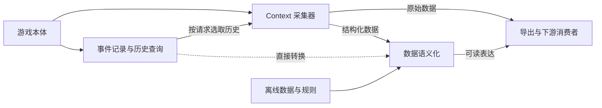

# 三模块总体设计

版本：v0.3。更新日期：2026-09-14。状态：当前开发方向；核心模块尚未实现，具体内部 schema 与打包细节待核定。

## 1. 目标与交付方式

项目提供事件记录、Context 采集器和数据语义化三个核心模块。它们分别回答“已观察到什么发生”“所选目标现在是什么状态”“这些已知事实怎样表达”。

以一个 MOD、一个项目版本组织交付，默认三个模块全部启用。独立开关、替代输入与离线样例用于分别调试，不要求三个模块独立发布。交付可以包含脚本包及按实际需要增加的资源包；文件数量不改变模块职责。构建与游戏加载方式需通过实测确认。

[开发与参考基线](reference-baseline.md)确定来源优先级：EA 逆向源码为主要实现依据，本地游戏为运行验证环境，Atlas 辅助静态分析，旧 Experience 仅在必要时参考。新实现的数据模型和顺序由本项目需求决定。

## 2. 模块边界

| 模块 | 输入与状态所有者 | 输出与协作 |
| --- | --- | --- |
| [事件记录](event-recorder.md) | 游戏通知、回调与必要 Hook；负责事件记录、持久化及历史索引 | 提供带身份、时间、来源与覆盖范围的历史；不依赖 Context 或语义化正在运行 |
| [Context 采集器](context-collector.md) | 请求、目标与游戏当前状态；负责字段能力目录、目标解析及请求组合 | 按需读取当前快照和事件历史，形成 Context；记录模块关闭时仍可读取当前状态 |
| [数据语义化](semanticizer.md) | 约定格式的普通数据与版本化规则资源；负责映射、规范化和表达 | 可处理快照、历史或离线输入；不隐式启动采集，不修改原始事实 |

模块内部直接通过约定的 Python 接口协作。公共部分只承载共享数据类型、身份/时间约定、配置和必要日志；每个模块明确管理自己的状态。避免跨模块直接修改内部缓存或全局表。

## 3. 默认数据流

三者全开表示能力可用，不表示每个请求必须包含全部历史和全部译文。设计师通过目标、字段、历史范围和表示方式选择所需数据。事件记录也可以直接交给语义化处理。

关闭或读取失败时，明确返回能力状态和原因，其他可用来源继续工作。记录模块停用不等于“此人没有历史”；语义化不可用时，原始数据出口仍可保留。

## 4. 共同的数据边界

- **实体身份**：Sim、Object 实例、对象定义和资源身份分开。导出时保证 64 位 ID 精度，按运行、地块及已核验的存档范围解释身份。
- **时间与范围**：当前快照带读取时点或区间；历史事件带发生/观察依据。游戏时间与现实时间分开，不把当前状态回填为过去状态。
- **事实与表达**：观测、规范化事实、确定性译文及未来的记忆/模型内容可区分。每条可读表达可追溯到原始数据和规则版本。
- **可用性**：成功确认没有数据，与未实例化、未支持、模块停用、尚未观测、读取错误和截断分别表达。
- **有界采集**：每个入口约定实体范围、字段、数量和频率；必要时报告截断或缺口。
- **世界连续性**：未验证存档与读档分支识别时按独立运行范围隔离，不能把不同运行或放弃的未来历史自动合并。
- **接口状态**：示意字段和函数名不是现成 EA API，也不等于本项目已冻结的 schema；在真实数据验证后确定版本。

历史事件本身属于首轮核心能力。长期记忆、印象卡、遗忘与角色认知是后续消费者；记录参与关系不意味着已实现完整的角色知识模型。

## 5. 游戏接入与生命周期

首先在 EA 源码中核对对象查询、原生通知及其实际发送点。已有通知不足时再为具体缺口实现 Hook，保留原函数返回值和异常行为；采集器自身异常不得改变游戏行为。

启动层统一协调配置、模块启用、zone/加载生命周期及关闭。必须验证重复注册、对象卸载、换地块与读档边界；独立关闭模块时释放其订阅与资源。第一版可在启动配置中选择启用组合，是否支持运行中切换另行确定。

游戏对象访问留在游戏允许的线程与时机。异步输出或外部消费者只处理复制出的普通数据，慢速消费者和文件错误不能阻塞游戏主流程。

候选入口见[技术接口目录](context-acquisition-interfaces.md)，构建与环境限制见[开发基线](reference-baseline.md)。

## 6. 各模块与集成验收

每个模块通过正式接口和必要的样例独立验证；完整验收覆盖“游戏发生指定事件 → 记录并回查 → 查询当前状态并选取历史 → 转换表达 → 导出”。

调试覆盖至少包括仅事件记录、仅当前状态、仅离线语义化，以及三个模块全部启用。原始数据、文本或二者组合应使用同一份事实来源。第一轮验收范围与待定项集中在[首轮实现与验收](implementation-and-validation.md)，不沿用旧原型的成功结果。

## 7. 下游及后续范围

设计师工具、Prompt、模型调用和 Overlay 显示消费本项目输出。请求关联、响应过期和展示确认属于下游集成设计，不能反向使三个数据模块依赖外部模型可用。

[后续扩展资料](vision/README.md)保留长期记忆、历史状态重建、LLM 事件执行及玩法说明。旧 Experience 的导入、接口兼容和实现移植只在具体需求成立时评估，不作为首轮前置任务。

## 8. 文档职责

本文件定义总体边界；三个模块文档细化职责；技术与内容目录帮助选择入口及字段；实现与验收文档统一首轮范围。历史阶段方案见[归档索引](archive/README.md)，其“下一步”不覆盖当前设计。
