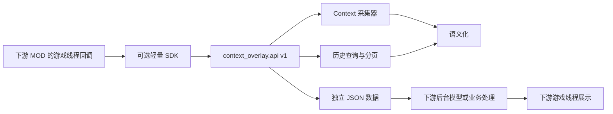

# ContextOverlay 公共 API v1 与 SDK 方案

日期：2026-09-15。提供方 MOD：**0.6.0 试用版**；公共 API：**1.1.0**；数据 schema：**1**；Python SDK：**1.1.0**。已完成离线契约测试，真实下游 MOD 接入验收仍待补。新增 `get_nearby_entities` 与 `context.nearby_entities` 能力，按半径、楼层和房间筛选 Sim／物件；完整参数、返回包和限制见[附近实体接口](nearby-entities.md)。原有方法保持兼容。0.6.0 事件支持情况及首局修正见[覆盖说明](event-coverage-0.6.0.md)。

## 1. 交付与边界

采用同一个 ContextOverlay MOD 提供版本化的进程内 Python 接口，下游可直接调用 `context_overlay.api`，也可将轻量 SDK 放进自己的包。SDK 只处理依赖、兼容性、错误和查询生命周期，数据始终来自玩家安装的那一份 ContextOverlay。



接口是同步、只读的，不要求打开控制台或写文件，也不改变游戏行为。历史查询会占用有界查询资源，需要关闭。接口不启动游戏、打开窗口、改变配置、触发事件或连接模型；跨线程调度、推送订阅、HTTP 服务和批量完整 Context 展开不属于当前 API；附近查询只返回有限的身份与空间数据。

这样下游可以先用简单回调完成“选定实体 → 读取 Context → 生成文本 → 展示”，后续 API 1.x 可增加可选能力，不再要求消费方跟随内部 Collector／Recorder 的变化。

## 2. 安装和最小接入

玩家安装 **ContextOverlay 0.5.0 或后续支持 API 1.x 的版本**。0.3.2／0.4.0 不提供这个公共入口。SDK 是源代码工具包，不是额外安装的脚本 MOD；开发者将 `sdk/context_overlay_client.py` 复制进自己的包，例如 `my_overlay_mod/vendor/`，并按 Python 3.7 打包。各级目录需要自己的 `__init__.py`。

```python
from my_overlay_mod.vendor.context_overlay_client import Client, ContextOverlayError

client = Client()  # 安全：此时不导入提供方或游戏服务。

def on_player_requests_context(sim_id):
    # 由下游 MOD 的游戏线程交互／alarm 回调执行。
    try:
        packet = client.get_context(
            "sim", str(sim_id), fields=["identity", "needs", "buffs", "interactions"],
            include_history=True, history_limit=15, representation="both")
    except ContextOverlayError as exc:
        return {"available": False, "error": exc.to_dict()}
    return {"available": True, "partial": packet["status"] == "partial", "packet": packet}
```

已有强制依赖加载机制的下游也可直接使用：

```python
from context_overlay import api

packet = api.get_context("sim", "active", fields=["identity", "needs"], history_limit=5)
```

直接入口会抛出 `api.APIError`；SDK 转换为自己的 `ContextOverlayError`。不要再引用 `game_runtime._runtime`、`runtime.collector` 或 `runtime.recorder`，也不要把核心包复制到下游。旧示例迁移后的版本见 `examples/mod_consumer.py`。

## 3. 版本与能力发现

```python
info = client.get_api_info()
status = client.get_status()  # 有活动运行时须在游戏线程。
```

`get_api_info()` 是纯元数据查询，可在加载存档前或后台线程调用：

| 字段 | 含义 |
| --- | --- |
| `api_version` | 当前公共契约版本 `1.1.0` |
| `module_version` | 提供方 MOD 版本，目前 `0.6.0` |
| `schema_version` | 数据协议版本 `1` |
| `capabilities` | `context.read`、`history.query`、`history.page`、`history.close`、`text.zh-CN` |
| `context_fields`、`default_fields` | 支持的字段与 Sim／Object 的默认选择 |
| `nearby` | 附近查询类型、指标、单位、返回数、扫描预算和半径限制；能力为 `context.nearby_entities` |
| `resource_text` | 可选 name／description／tooltip 文本证据，能力为 `text.resource_details`；官方中文词表与 MOD 覆盖边界见[资源语义目录](resource-semantics.md) |
| `max_history_page_size`、`max_context_history_limit` | 请求单页／近期条数上限，各为 500 |
| `thread_policy`、`transport` | `simulation_thread`、`in_process_python` |
| `scope`、`history_scope` | 当前地块已实例化实体、本次运行历史 |

能力存在不表示配置已启用。`get_status()` 返回 `ready`、`state`、`session_id`；状态可为 `waiting_for_zone`、`starting`、`startup_failed`、`closed`、`ready`。只有 ready 时附带 `modules`、`recorder` 和 `query_limits`。

`ready=true` 表示运行初始化完成，不意味着记录器一定健康。`modules` 包含 `collector_enabled`、`recorder_enabled`、`semanticizer_enabled`；记录器的 `state/error/persistence` 单独报告。字段、资源名称和单条事件也有各自可用性，不应压成一个全局成功布尔值。

SDK 检查 API 主版本为 1、schema 为 1，接受兼容的 1.x 小版本；不固定准确 MOD 版本。API 1.x 保持已公开的方法和现有字段含义，允许增加可选参数、字段和能力；消费者忽略未知附加字段，对状态／枚举保留未知分支。删除接口或改变既有语义需升级 API 主版本，数据不兼容变化需升级 schema。内部 Python 模块不属于这个承诺。

## 4. 当前 Context

公共函数和 SDK 的参数含义一致：

```python
get_context(kind="sim", identifier="active", *, fields=None,
            include_history=True, history_limit=15, include_internal=False,
            representation="both", expected_session_id=None)
```

| 参数 | 约定 |
| --- | --- |
| `kind` | `sim` 或 `object` |
| `identifier` | 正的 64 位实例 ID（十进制字符串或 Python int）；仅 Sim 支持 `active`。不接受游戏对象、对象定义 ID、float、0、bool |
| `fields` | 非空且不重复的字段 list／tuple。None 使用下表默认值；字符串 `"needs"` 不能代替 `["needs"]` |
| `include_history` | 是否附带近期历史，必须为 bool |
| `history_limit` | 1–500 的整数，默认 15；即便不请求历史也须合法 |
| `include_internal` | 是否包含内部步骤，默认 false |
| `representation` | `raw`、`text`、`both`；text/both 均附带原始证据及 rendered，并非返回单个字符串 |
| `expected_session_id` | 可选运行约束；与当前运行不同则拒绝，不自动改用新存档的数据 |

全部字段为 `identity`、`location`、`time`、`interactions`、`needs`、`buffs`、`relationships`、`object_states`。默认 Sim 请求前七项，Object 请求 `identity/time/location/object_states`。显式请求不适用的字段会得到 `not_applicable`，不会替换成 0。

`active` 在请求开始时解析为固定 Sim ID。请求随后读取该实体，返回 `read_started/read_finished`；这是同步读取区间，不承诺游戏世界的事务快照。历史按最近更新顺序取最多 N 条，不创建游标；更复杂的时间／类型查询使用下一节接口。

返回 ContextPacket 的关键结构：

```text
api_version / module_version / schema_version
session_id / request_id / recorded_at / kind="context"
target / scope / requested_fields / read_started / read_finished
status="complete"|"partial" / representation / provenance
snapshot.<field> = {status, value, source, reason?}
history = {status, events, coverage?, target_observation?, limit?, truncated?, ...}
rendered? = {language, rules_version, current, history} 或 {status:"disabled", reason}
```

`complete` 仅表示本次请求没有被模块／字段不可用阻断，不保证名称全部翻译成功、历史完整或全部事件已写盘。字段状态包括 `available`、`not_present`、`not_applicable`、`unsupported`、`out_of_scope`、`disabled`、`error`；名称的 `unresolved_tokens/no_display_name` 等是另一层状态。

关闭记录器或记录失败时，Context 仍可读取当前状态，所附历史明确标记 `disabled/failed`，包为 partial。关闭语义化时原始数据仍返回，rendered 标记 disabled。关闭 Collector 时 `get_context` 抛 `collector_disabled`，历史接口仍可调用。范围外实体的当前字段标为 out_of_scope，历史是否曾观测由 `target_observation` 说明。

返回值已复制为 JSON 数据，下游修改字典不会更改记录器。所有 ID 和 ticks 输出使用字符串以保留精度；数值需求是游戏内部单位，不是百分比。

## 5. 历史查询、翻页和关闭

```python
query_history(kind="sim", identifier="active", *, page_size=15,
              include_internal=False, time_field="first_observed",
              from_ticks=None, to_ticks=None, event_types=None, fields=None,
              outcomes=None, tuning_ids=None, order="desc", group_effects=False,
              representation="both", expected_session_id=None)

get_history_page(cursor, *, expected_session_id, representation="both")
close_history(cursor, *, expected_session_id)
```

首个调用返回完整 HistoryPacket：外层含版本、request_id、session_id、target、provenance、status、representation；内层 `history` 含事件、游标与覆盖，`rendered.history` 为逐条中文。这个形状与 ContextPacket 中的历史区域一致。

| 参数 | 含义 |
| --- | --- |
| `page_size` | 每页 1–500 条；默认 15 |
| `time_field` | `first_observed`、`started` 或 `ended`，默认首次观测 |
| `from_ticks/to_ticks` | 游戏整数 ticks 或整数字符串，范围 `[from, to)`，None 不设边界。不是现实秒／Unix 时间 |
| `event_types` | 非空 list／tuple，可含 `interaction`、`state_change`、`game_event` |
| `fields` | 变化字段或新增 category，例如 `["buffs", "relationship.bits"]`、`["skill.level", "statistic.direct"]`；不是 Context 字段选择 |
| `outcomes` | 交互结果：`completed/cancelled/failed/unknown` |
| `tuning_ids` | 交互定义 ID 的字符串列表，不是交互实例 ID |
| `order` | `asc` 或 `desc`，默认倒序 |
| `group_effects` | 默认 false；true 将与同一结果集内动作明确关联的事实放入其 `effects`，未匹配的效果仍单独显示 |

列表筛选最多 64 个非空字符串；None 表示不筛选。不同条件取交集。没有开始／结束时间的事件不匹配对应时间筛选，状态变化按通知观测时间筛选。

0.6.0 不生成需求／关系定时差值，也不返回采样区间。`state_change` 保留 Buff、关系标记、物件状态前后值；新增 `game_event` 使用 `category/field/payload`。`statistic.direct` 的 `payload.before/after` 只来自明确 Loot 操作内真实通知，`cause` 保留可核验操作／交互依据。当前数值仍使用 `get_context(fields=["needs", "relationships"])`。没有记录不证明数值未变化。

新增能力标识为 `history.effects`、`history.retained_identity`、`history.fifo`、`events.gameplay`；`get_api_info()` 返回 `event_types/event_categories/retention_policy`，`get_status()` 返回具体源的 `event_coverage`。SDK 1.0.0 已支持透传筛选参数，无需升级 SDK 主版本。按能力发现后再使用新参数，0.5.0 提供方不支持它们。

0.6.0 首局修正增加 `get_status().event_diagnostics`，包含 `callbacks`、`suppressed_statistics`、`suppression_policy` 和 `timing`。它们是适配器回调／计时通知的汇总数，不是事件数量或性能测量；目前 timing 为 not_measured。事件源健康与汇总在会话开始、结束落盘。TimeSince 计时统计不再发布为历史，当前 Context 不受影响。使用角色判断效果归属，不要把 entities 索引列表当作受影响者列表；具体新增字段见[事件契约](event-coverage-0.6.0.md)。

按数字 ID 查询历史时先使用本运行保留的实体身份，不要求当前仍有可读取实例；Context 继续独立报告 out_of_scope。分组后 `total_matches` 是显示行数，快照预算仍计入全部效果事实。某动作未进入筛选结果或已被 FIFO 淘汰时，相关效果保持独立行。完整示例见 [SDK 事件示例](../sdk/examples/event_history.py)。

分页中的关键字段：

| 字段 | 含义 |
| --- | --- |
| `events` | 本页固定修订的事件；原始结构与现有日志／Context 一致 |
| `cursor` | 当前页游标，也可用于释放整个查询 |
| `next_cursor`、`has_more` | 下一页与是否存在下一页；没有下一页时 next_cursor 为 null |
| `total_matches`、`page_size`、`offset` | 本次查询匹配数及页位置 |
| `query_id`、`as_of_sequence` | 查询身份及创建时已接收序列 |
| `created_at`、`expires_in_seconds` | 创建现实时间与剩余有效秒数 |
| `filters`、`target_observation`、`coverage` | 实际筛选、目标观测情况和查询创建时的记录器／写盘状态 |

查询冻结首次创建时的事件成员及修订，后续新事件／新修订不改变已有页。再次使用同一个 next_cursor 可以重取该页；外层 request_id／recorded_at 是新请求，剩余有效时间会减少。游标是不可解析、不可拼装的句柄，消费方应原样传回。

分页必须携带首次响应中的 session_id 作为 expected_session_id。读档、旅行、重启或 `co.restart` 后旧查询失效。默认 TTL 为 **120 秒现实时间**，暂停游戏也计时；翻页不续期。最后一页不会自动释放，关闭窗口或刷新时主动关闭。

`close_history` 幂等：首次成功为 `{released:true, reason:"closed"}`；已过期、已关闭或运行结束为 `{released:false, reason:原因}`。错误线程和非法游标仍会报错，不会默默执行。关闭旧运行的句柄不会关闭新运行的查询。

默认最多同时 8 个查询、合计 100,000 个事件引用和 256 MiB 估算预算；**这是所有下游及本 MOD 窗口共享的预算**，不是每个 SDK 客户端单独拥有。查询资源不是权限隔离机制。`query_limit/query_budget` 只拒绝新查询，不暂停采集；应缩小范围并及时释放，不应反复重试宽查询。

## 6. SDK 管理句柄

```python
with client.history("sim", str(sim_id), page_size=15,
                    event_types=["interaction"], from_ticks=start_ticks) as query:
    packet = query.page
    if query.has_more:
        packet = query.next_page()
```

`query.page` 是完整 HistoryPacket；`session_id` 固定，`has_more` 表示还有下一页，`next_page()` 到末尾返回 None。失败不会推进内部游标。`close()` 可重复调用；关闭后 `next_page()` 返回 `query_closed` 错误。修改返回页不会修改提供方或 SDK 保存的导航游标。

`with` 会在正常退出和消费逻辑抛异常时尝试关闭，不用垃圾回收析构函数触发游戏调用。跨多个 UI 回调时持有句柄，并在关闭回调显式释放。示例见 SDK 包的 `examples/consumer.py`。

## 7. 错误契约

直接调用抛 `api.APIError`，SDK 抛 `ContextOverlayError`，均有 `code/message/details` 和 `to_dict()`。调用参数名称错误也转换成 invalid_request。按 code 分支，不解析 message 的措辞。

| code | 消费方处理 |
| --- | --- |
| `dependency_missing`（SDK） | 提示安装提供方，不展示空数据为成功 |
| `incompatible_api`（SDK） | 提示提供方／SDK 升级；不回退到私有接口 |
| `provider_error`（SDK） | 提供方导入、元数据或契约之外失败，保留诊断 |
| `not_ready` | 尚未进入地块、初始化中或启动失败；状态原因在 details；等待下一个合适的游戏回调 |
| `wrong_thread` | 把调用移回游戏模拟线程，不从网络回调重试 |
| `session_changed/session_closed` | 丢弃旧数据和游标，按新运行重新请求 |
| `collector_disabled` | 当前状态采集关闭；可单独查询历史或显示不可用 |
| `target_unavailable` | 例如没有当前操控 Sim；选择明确实体或等待其可用 |
| `invalid_request` | 修正参数名称、类型、ID、字段、条数等 |
| `invalid_query` | 修正历史时间／类型筛选或页大小 |
| `invalid_cursor` | 只使用原样返回的有效游标 |
| `cursor_expired` | 重新创建查询，不在旧快照上继续翻页 |
| `query_limit/query_budget` | 关闭旧查询、缩小时间范围／筛选 |
| `query_closed`（SDK） | SDK 句柄已关闭，创建新的句柄 |
| `internal_error` | 本 MOD 未预期失败，保留 details 和运行信息用于排查 |

字段不可用和历史采集失败通常在正常响应中形成 partial，并非全部变成异常。不得将 `disabled/error/out_of_scope/not_observed` 当成数值 0 或“没有发生”。

## 8. 线程、频率和结果时效

附近接口另外使用 `target_out_of_scope` 和 `spatial_unavailable`；旧提供方不支持邻近能力时 SDK 返回 `capability_unavailable`。具体语义见[附近查询错误表](nearby-entities.md)。

Runtime 记录初始化它的线程身份；有活动 Runtime 时，公共运行接口在任何游戏对象读取或查询表操作之前验证调用线程。嵌入式游戏线程不假定等于 Python 的 `main_thread()`。`get_api_info` 无此要求；尚未建立 Runtime 时状态可报告 waiting_for_zone，但这不意味着游戏调用支持后台线程。

一次 API 调用同步完成；历史查询的首次筛选会检查候选事件，不承诺零耗时。推荐按玩家操作或自己的低频游戏回调查询，选择所需字段和有限时间窗口，不每帧扫描全部实体或全部历史。

将返回的普通字典交给后台模型或网络逻辑；不要把游戏对象、SDK 查询句柄或 `_runtime` 交给后台。模型结果返回后，通过下游自己的游戏线程回调检查当前 session_id、目标身份和最近 request_id，再展示或丢弃。session_id 相同并不能证明同一次运行内的较旧请求仍然适合展示。

## 9. 测试和后续演进

本仓库的 `tests/test_public_api.py` 使用真实 Collector／Recorder 加替身适配器，覆盖就绪、线程检查、参数验证、模块降级、复制隔离、会话切换、固定版本分页、资源释放、错误处理与 SDK 兼容性。SDK 附带合成 ContextPacket 和离线预览，允许下游先开发 Prompt／展示层；`Client(provider=...)` 支持注入契约替身。

仍需实机验证跨 MOD 导入顺序、游戏线程身份和加载／旅行／重启时机。SDK 无需读取游戏源码，但下游负责安排自己的线程回调。通过真实消费 MOD 验证 v1 后，再按实际需求考虑异步请求队列、增量事件订阅、批量实体查询或更多字段；目前这些都不属于已实现能力。
