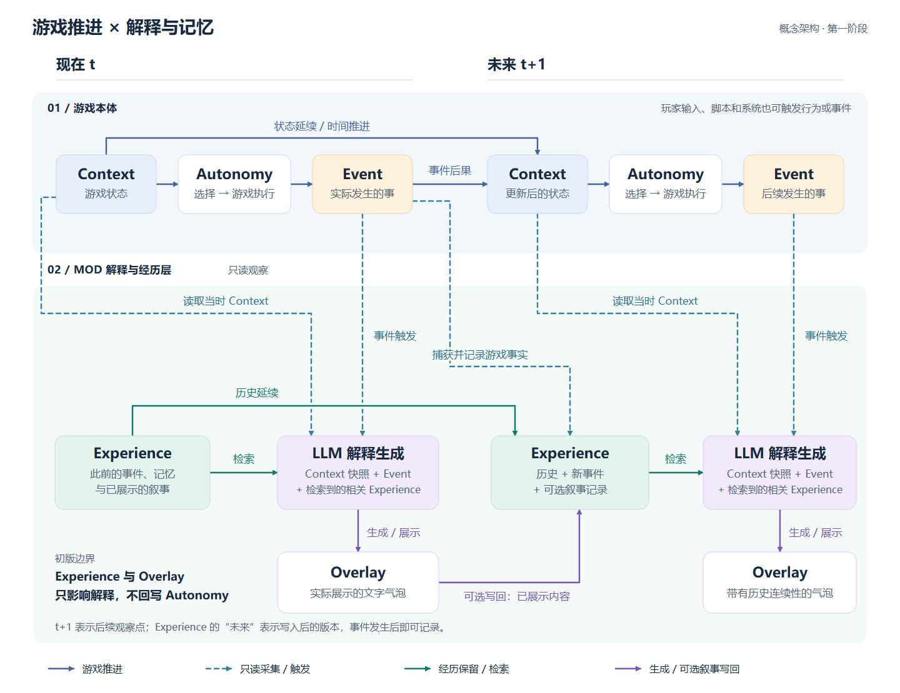
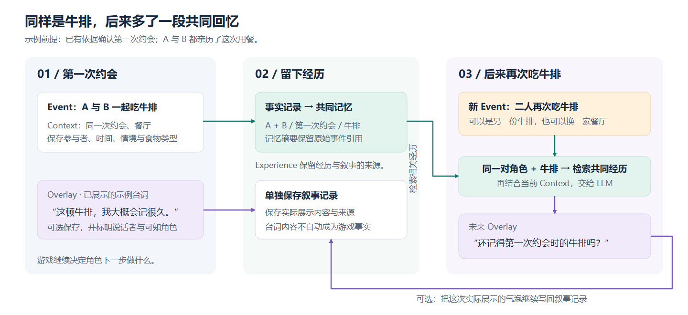
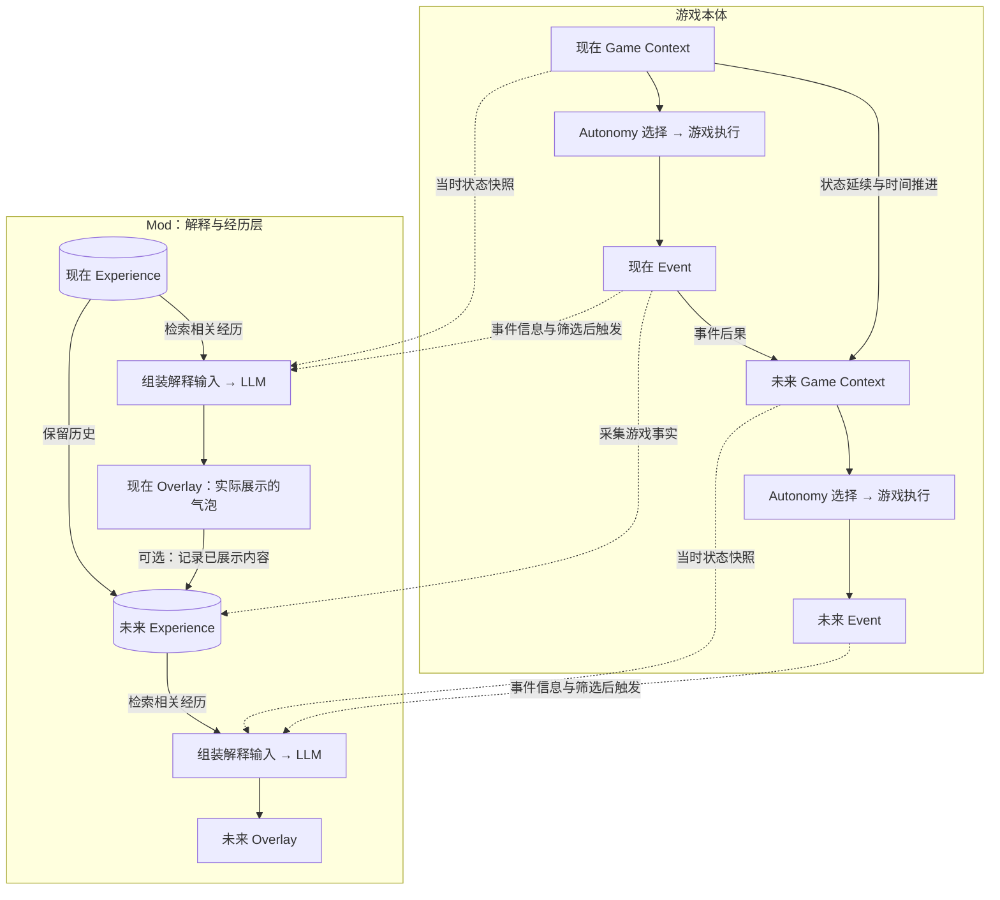

# 游戏本体、Experience 与 Overlay 流程图

> 后续扩展资料（2026-09-14 整理）：本文保留历史研究或产品愿景，旧阶段的实施顺序不作为首轮要求。当前开发以[三模块总体设计](../modular-context-provider.md)和[首轮实现与验收](../implementation-and-validation.md)为准。这里的 Experience 可表示历史能力，不要求依赖旧 Experience MOD。

版本：v0.1 · 日期：2026-09-11 · 性质：概念架构与示例，尚非游戏实机验收结果。

范围说明：本图包含后续记忆能力。当前总体方向见[三模块设计共识](../modular-context-provider.md)：最终三个模块全部启用，设计师按请求选择是否包含历史；调试时可单独验证当前快照到 Overlay 的通路。

**游戏本体负责产生行为与后果；Overlay 依据当时的事件、状态和相关经历生成解释；Experience 为后续解释保留事件与叙事。**

- [打开可离线浏览的图解页面](overlay-experience-flow.html)：切换总览与牛排示例，下载 SVG，打印或保存 PDF。
- [单独打开总览 SVG](diagrams/overlay-experience-flow.svg) / [单独打开示例 SVG](diagrams/steak-memory-example.svg)：矢量图可放大。
- [总览 PNG](diagrams/overlay-experience-flow.png) / [示例 PNG](diagrams/steak-memory-example.png)：可直接预览或插入其他文档。

## 1. 完整流程

按从左到右的“现在 → 未来”理解：上方是游戏本体，下方是 Mod。蓝色虚线表示只读观察，绿色表示经历保留与检索，紫色表示生成与可选叙事写回。

- 当前 Context 经 Autonomy 选择与游戏执行产生 Event。玩家输入、脚本、计时器与其他系统也可触发行为或事件，图中仅用文字注明这些入口。
- 事件对应的游戏过程可能改变后续 Context；未来状态同时来自原有状态的延续与时间推进。
- 当前 Event 触发解释流程。它与事件相关的 Context 快照、从 Experience 检索到的历史共同构成 LLM 输入。
- 当前 Event 的事实写入 Experience；实际展示的 Overlay 可单独写入叙事记录。未来解释检索更新后的 Experience。
- 初版没有 Experience / Overlay 向游戏状态或 Autonomy 的回写。

`t+1` 表示后续观察点，不要求是紧邻的游戏 tick；“未来 Experience”表示写入后的版本，事件发生后即可记录。未来 Event 按同一模式继续写入，再更新下一版 Experience。

## 2. 名称与边界

| 概念 | 定义 | 例子 |
| --- | --- | --- |
| Game Context | 游戏状态的概念集合，包括当前需求、关系、环境，以及队列、计时器和正在运行的交互 | 饥饿、处于约会、某个交互已经排队 |
| Action / Interaction | 被选择或安排执行的行为，可能开始、完成、中止或失败 | 去吃牛排 |
| Event | 实际发生的行为、生命周期事件或状态变化；应区分计划、尝试与结果 | 开始吃、吃完、交互取消、观测到需求变化 |
| Experience | Mod 维护的历史事实、派生记忆与叙事记录的总称 | 曾经共同用餐的事实与有关台词 |
| Explanation Context | 这一次解释所需的输入集合 | 当时状态快照 + 当前事件 + 相关历史 |
| Overlay | 根据解释输入生成并展示的对白、独白或旁白 | 角色头上的文字气泡 |

**Explanation Context = 事件相关的 Game Context 快照 + 当前 Event + 检索到的相关 Experience。**

Experience 扩展的是 LLM 的解释输入。图中的 Game Context 是概念上的游戏状态；Mod 实际取得的快照只能覆盖可采集、已声明的字段。

`Event → Context → 后续 Event` 是状态演化的抽象，不要求引擎内部完全不存在直接事件链。回调、后续交互与计时器可能由事件直接安排；将这些待执行状态纳入 Context，可以在概念上统一表达。图中的 Event → Context 表示对应游戏过程的后果，不表示“写一条日志就改变游戏”。

## 3. Experience 内部区分三类来源

| 记录 | 内容 | 后续用途与限制 |
| --- | --- | --- |
| Event Log：游戏事实 | 参与者、游戏时间、情境、物件、行为和实际结果等已观察信息 | 回忆的事实依据；保留来源和覆盖范围 |
| Memory：派生记忆 | 共同经历、摘要、印象等，附原始事件引用 | 帮助检索、组织和压缩；不能丢失事实与推断的区别 |
| Overlay Record：叙事记录 | 实际展示的内容、关联事件、说话者、可知角色与来源 | 延续已说过的话；内容中的陈述不自动成为游戏事实 |

例如“我们下次还来这里”可以形成叙事中的约定，但不会自动安排游戏内约会，也不能证明后来已经再次到访。生成但没有展示的候选可以作为调试记录保存，不应被检索成角色已经说过的话。

内部数据组织进一步见[共享事件、实体视角与记忆的架构建议](../archive/2026-09-research/event-memory-architecture.md)：这里的 Experience 是历史层的概念名称，不要求依赖同名的现有 MOD。一个共享事件可以被不同 Sim 的经历视角和记忆引用；普通 Object 使用关联事件时间线。

## 4. 牛排约会示例

示例前提：已有依据确认这是 A 与 B 的第一次约会，双方都亲历了这次用餐。以下台词是示意生成内容。

1. **第一次约会：**游戏观察到 A 与 B 在同一约会情境中吃牛排。保存参与者、情境、时间、食物实例和“牛排”类型标签。Overlay 可以显示：“这顿牛排，我大概会记很久。”
2. **留下经历：**用餐是游戏事实；有关台词单独保存为已展示的 Overlay 内容。派生共同记忆保留原始事件引用。
3. **后来再吃牛排：**新的 Event 触发检索。以“同一对角色 + 牛排 + 共同经历”找回旧事，再结合当前关系、情绪与场景生成：“还记得第一次约会时的牛排吗？”
4. **继续更新：**新的实际展示内容也可写入叙事记录，帮助以后接续对话。角色下一步做什么仍由游戏本体决定。

食物实例不同不会阻断主题检索；具体实例与语义类型都要保留。角色知识范围也要明确：亲历、目睹、被告知与玩家可见旁白不是同一种知情依据。

若只能证明“最早采到的一次约会”，不要直接写成“人生第一次约会”，应使用“那次约会”等有依据的表达。

## 5. 第一阶段落地约束

- **记录与展示独立：**在明确范围内记录可观察事件，筛选、合并和冷却后再触发 Overlay。不能承诺已覆盖整个游戏的全部内部事件。
- **绑定事件快照：**生成使用事件相关快照；若描述后果，需要实际结果或事件后状态。展示前检查实体与场景是否仍然适用，避免延迟后的错位对白。
- **区分机制解释和叙事：**Context、Event 与 Experience 可以支持符合情境的叙事；若要说明 Autonomy 的真实决策原因，还需要候选、评分等决策证据。
- **保留身份与来源：**事件 ID、实体身份、存档 / 读档分支、游戏时间、来源类型与角色知识范围需要可追溯，避免重复记录或跨分支误用经历。
- **保持初版边界：**当前图只描述解释和历史记录；涉及修改游戏行为、关系或状态的后续功能需要单独设计执行与实际结果确认链路。

相关依据：[运行时 Context 分类](../runtime-context-taxonomy.md)、[状态与经历分层](state-history-and-generated-events.md)、[Context 覆盖研究](../archive/2026-09-research/context-coverage-study.md)。

## 6. 可编辑的 Mermaid 版本

上面的 PNG 用于直接阅读，同时保留 SVG 矢量版本；下面的 Mermaid 用于修改逻辑关系。节点布局可由支持 Mermaid 的 Markdown 编辑器重新生成。

## 迭代记录

| 日期 | 版本 | 变更 |
| --- | --- | --- |
| 2026-09-11 | v0.1 | 明确解释层初版边界，绘制现在 / 未来总览与牛排共同记忆示例，提供离线页面、SVG、PNG 和 Mermaid。 |
