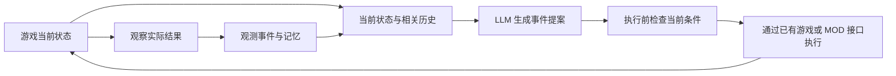

# 从采集数据到状态、经历回顾与 LLM 事件

> 后续扩展资料（2026-09-14 整理）：本文保留历史研究或产品愿景，旧阶段的实施顺序不作为首轮要求。当前开发以[三模块总体设计](../modular-context-provider.md)和[首轮实现与验收](../implementation-and-validation.md)为准。这里的 Experience 可表示历史能力，不要求依赖旧 Experience MOD。

版本：v0.1。日期：2026-09-11。

本文回答三个问题：技术分类是否都是游戏本体已有数据；Sims4-Experience-Mod 的经历属于哪类；如何用它们恢复 Sim/Object 的状态和历史，以及在线生成新的事件。

依据为[参考资料基线](../archive/2026-09-research/reference-baseline.md)中的本地源码及历史样本。本轮补查 Experience 的事件构造、时长、Loot 明细和卡片折叠，并只读检查 `win0910`；没有运行游戏或实现新的采集/事件执行功能。下文架构与字段属于建议设计。

## 1. 结论与能力边界

**离线经历回顾、在线 LLM Context 和事件生成都可作为可落地目标。现有 Experience 已提供经历素材，但不能据此承诺在任意时刻恢复任意 Sim/Object 的完整状态与全部经历。**

| 目标 | 现有资料支持到什么程度 | 还需要什么 |
| --- | --- | --- |
| 游戏运行时查询某个 Sim/Object 当前状态 | 可从已验证的服务、tracker、component 读取一部分字段 | 明确实体/字段范围、版本、时点；处理未实例化、已删除和读取失败 |
| 游戏后回顾一个 Sim 在某游戏日做了什么 | 可从已记录事件整理时间线、参与者和部分后果 | 核对整日采集覆盖、交互区间、时间单位和缺口；以原始事件为依据 |
| 查看某个 Object 被谁使用、与什么经历有关 | 可从 target、via_object、参与关系和因果引用查出一部分 | 统一物件身份和反向索引；单独采集无人参与的对象变化 |
| 游戏后恢复某历史时刻的指定状态字段 | 当前 Experience 不能保证；Observer 可补充其已观测时点和范围内的部分状态 | 初始/周期快照、实际状态变化、有效时间和版本；缺失时标未知 |
| 游戏中给 LLM 提供 Context，生成新的随机事件 | 数据与接口基础可复用，整体管线尚未在本项目实现 | 当前状态查询、历史检索、事件能力目录、执行前复核、执行结果回录 |

在线生成可以先使用实时状态和有关历史，不要求先完成全量历史状态重建。历史重建能力可以按玩法逐项扩展。

本阶段已进一步收敛为[当前状态 + 已记录经历的查询与输出 MVP](../archive/2026-09-research/context-query-and-output-mvp.md)：先验证最近交互记录的展示、确定性语义化和统一数据出口，暂不实现模型生成、效果执行或完整历史重建。下文保留这些扩展目标的研究依据。

## 2. 哪些属于游戏内置，哪些由 MOD 新增

前一份[技术分类](../context-acquisition-interfaces.md)包括获取入口、观测机制和数据通道，不表示每类都存在一份可直接查询的完整原生数据库。

| 数据层 | 游戏本体与 MOD 的关系 | 例子 |
| --- | --- | --- |
| 原生状态与定义 | 游戏已经持有，采集器读取并解释 | 当前 Buff、关系轨道、物件状态、tuning 参数、存档中的角色信息 |
| 运行中发生的事实 | 游戏执行了调用或状态变化，MOD 在发生时观察并保存 | 完成一次交互、加入约会、一次 Buff 增删；不保证游戏自己长期保留历史 |
| MOD 组织出的历史与索引 | 原始事实来自游戏，记录格式、事件 ID、跨事件引用及持久化由 MOD 建立 | Experience JSONL、按 Sim/Object 查询的时间线、历史事件关联 |
| 派生数据 | 规则或模型从证据计算，不能自动等同于游戏原生事实 | 使用次数、物件印象、好恶标签、经历摘要、因果推测 |
| Overlay 自有状态 | 由 Overlay/MOD 新建并维护 | 已显示对白、未完成情节、玩家选择、待执行事件提案 |

T09 中尚未开发的 Native/客户端观测也不能算作已可取得的数据。T07 的执行跟踪是一种观测技术，不意味着游戏预先保存了所有调用和局部变量。

## 3. Experience 的事件究竟属于哪一类

其技术路径主要是 **T03 Hook / T04 GSI 获取 → T01 补少量当前字段 → T08 保存和提供历史**。从内容上说，原始事件主要对应 **C09 近期事件**；留存、检索和折叠后用于 **C10 历史经历与印象**。

| Experience 数据 | 主要采集入口 | 技术归类 |
| --- | --- | --- |
| `did` / `received` | 包装 `archive_interaction`；另包装 `Interaction.cancel`；读取 target/participants 等 | T04 + T03，辅以 T01 |
| `perceived` | Broadcaster effect、ReactionTrigger 函数包装 | T03；当前不是一条完整的原生感知总线 |
| `changed` | Loot 容器/具体 op、Buff 增删包装 | T03；记录操作与部分效果，不能统一视作完整的状态 patch |
| `joined` | Situation 成员增删包装；zone 就绪时枚举角色并记录进入 | T03 + T01 |
| `decided` | 包装 `archive_autonomy_data`，截取部分候选和选择信息 | T04 + T03 |
| `events/<slot>/<sim>.jsonl` | writer 持久化上面的记录 | T08；文件是数据载体，底层来源仍是游戏调用与查询 |
| 印象卡、标签、语义记忆 | folding、object_tags、模型等消费经历记录 | T08 中的派生结果；与原始事件分开保存 |

MOD 的额外价值包括“在当时捕获并留存原本短暂的信息”和“把信息组织成可追溯的经历”。这些记录不会仅因为来自游戏调用，就自动包含所有参与者、前后状态和确定因果。

## 4. 经历事件为什么不足以恢复任意状态

### 4.1 经历描述与状态变化的精度不同

“吃了一份饭”和“饥饿值从 40 变为 75”可以关联，但它们是两种记录。前者支撑活动回顾；后者才适合直接更新一个历史状态视图。

Experience 当前 `_op_summary()` 读取的是 op 上的 `stat`、`amount`、`value` 等属性；`_on_op_applied()` 用它构造 `changed`。这不是统一测得的实际 before/after。实际增量还可能受到倍率、上限、条件失败或其他系统影响。

例如用假设的归一化 0–100 刻度说明：当前值为 80，操作配置为增加 30，但实际上限为 100。直接把配置累加会得到 110；记录实际 `before=80, after=100` 才能重建正确结果。该刻度只是示意，不是所有 Sims 4 statistic 的真实范围。

### 4.2 需要知道采集起点之前的状态

只记录“新增 Buff”不能知道采集开始时已经存在的 Buff。当前 Buff remove hook 在找不到内部 add/handle 配对时直接不记录，因此仅靠该事件流不能保证重建完整 Buff 集合。

同理，人物原有关系、物件原有库存、已在进行的交互与 Situation 都需要基线。名字/人格快照、印象卡和 `_cumulative.json` 也不能替代这一基线：后者保存的是卡片折叠进度和结果，不是世界状态快照。

### 4.3 时间、身份和生命周期必须闭合

本轮核对发现：

- 交互 `did` 的时间通常是终态 emit 时刻；它不是完整的开始/结束区间。
- 交互的 `duration_min` 取 `consecutive_running_time_span.in_minutes()`，属于游戏时间跨度；Buff 与 Situation 的同名字段按 `time.time()` 差值计算，属于现实分钟。不能统一当成游戏分钟倒推开始时间。
- `folding.event_sort_key()` 按现实时间和事件编号组织卡片重放。生成“某游戏日的经历”需要另外依据游戏时钟与分支分组。
- 当前启动场次槽不是完整存档/读档分支身份；回滚或跨存档的历史不能直接连成一条时间线。
- Object 创建、删除、部件/宿主、库存迁移、所有权变化，以及无 Sim 主体的修改，需要独立覆盖。

事件缺口、采集停用、过滤、队列溢出和未覆盖的后台行为同样会影响重建。应当把状态标成未知或部分可恢复，不能让 LLM 推测补齐后再作为游戏事实使用。

### 4.4 印象卡是查询加速与语义结果

当前 `folding.py` 的 `EVIDENCE_CAP=20`，且卡片以计数、净效果、标签等为主。因此需要保留原始 JSONL，通过它回查完整可用经历。卡片可以辅助检索、摘要和排名，不足以单独重建历史状态或逐条活动。

## 5. 支持状态重建需要增加的数据

对选定实体与字段，至少应区分以下记录：

| 记录 | 必需信息 | 作用 |
| --- | --- | --- |
| 实体/状态快照 | 实体身份、字段、值、游戏时点、版本、枚举范围及缺失状态 | 建立初始状态，并缩短后续回放区间 |
| 实际状态变化 | 实体、字段或集合操作、实际前后值、发生时点、观测序号、来源 | 更新状态视图；覆盖集合增删和实体创建/删除 |
| 经历事件 | actor、target、参与者角色、开始/结束/结果、情境、来源与相关状态变化 ID | 回答“做过什么、和谁、发生了什么后果” |
| 覆盖与连续性记录 | 存档/分支/session、采集起止、重连水位、支持字段、缺口、截断原因 | 判断某个查询结果是否完整、新鲜和可恢复 |
| 定义与版本引用 | 统计量/物件/交互定义、单位、规则和采集版本 | 正确解释数值、身份和旧记录 |

指定时点的状态重建可以表达为：

```text
state(t) = replay(最近且不晚于 t 的有效快照, 此后到 t 的实际状态变化)
```

成立条件是：查询字段有基线、变化充分、顺序可确定、数据属于同一世界分支，且重放方法已验证。遇到没有基线或无法解释的缺口，结果应携带字段级 `unknown/partial`。

连续衰减的需求、计时器、位置与移动路径要单独规定精度。可以保存指定 tick/检查点的值；如果要计算两点之间的值，还需核验时间模型、速率和所有改变它的因素。只存两端值并插值，不能承诺任意时刻准确。可以把第一阶段目标定为“关键事件前后或固定采样时点的指定字段”。

已有 Observer 的 tick 状态和 delta 能为其覆盖字段提供补充；它面向限定实体和观测范围，不能直接升级为全 Sim/Object 世界快照。

## 6. 游戏后生成“某个 Sim 的一天”

这是现有经历采集最接近的应用。数据处理建议如下：

1. 选择明确的存档分支、Sim 身份与游戏日；跨 session 仅在确认连续时合并。
2. 核对采集起止和空窗，识别该日是否完整覆盖。没有事件不自动表示角色什么都没做。
3. 取该 Sim 的主动、接受、已证实感知、状态变化和情境事件；按身份关联跨 Sim 事件。
4. 将交互开始/终态、Situation 和后果整理成活动区间。无法确定开始时间或时长时，保留“在该时刻记录到完成”等更精确的表述。
5. 将有关物件、地点、关系和目标接入时间线。相关上下文通过 ID 引用，不按同名实体合并。
6. 用规则或 LLM 生成日记、时间线或叙事；每一段可回查事件 ID，区别已观测事实、摘要和推断。

一份可用回顾应包含“覆盖的游戏时间段 + 已记录活动 + 重要变化 + 缺口”，而不是只有一篇流畅叙述。Object 也可以采用同样的反向检索：谁使用它、何时移动/被消耗/损坏、关联哪些经历；只有同场出现时应标为背景关联。

### 本轮样本检查

在 `win0910/events/` 全部文件的 3,934 条记录中，`ts_game` 覆盖：

```text
08:00:00.000 day:0 week:0
到
12:11:51.000 day:0 week:0
```

这表示已有数据可以支撑该上午已记录活动的回顾，不能据此声称覆盖整整一天；上述最小/最大时间也不能证明区间中间没有漏采。

同一数据集中，2,332 条 `loot:` 事件的 detail 字段出现 `op/stat/amount/value`，没有 `old_value/new_value` 配对；所有事件均无非空 `context_ref`。这与源码中的记录方式一致，不能把该历史样本当作完整状态变更流。它是旧样本，不构成当前源码实机验收。

## 7. 游戏中作为 Context 生成新的随机事件

在线调用可以使用四部分输入：

| 输入 | 数据来源 | 用途 |
| --- | --- | --- |
| 当前状态 | T01 实时快照，附采集时点和字段覆盖 | 判断现在有哪些角色、物件、需求、关系、情境和资源 |
| 有关经历 | T08 检索 T03/T04 等保存的事件、记忆及证据 | 让事件接续此前行为与关系，而非每次从零开始 |
| 当前可用条件与效果 | T05 规则、已验证测试结果、MOD 支持的执行接口 | 限定具体角色/物件和可实现效果；候选与实际执行分开 |
| 已有生成进度 | Overlay 自有状态、玩家实际选择、已执行事件记录 | 延续情节，避免重复触发或把未执行提案当成事实 |

建议形成以下闭环：



LLM 响应有延迟，执行前需要再次核对目标实体是否仍存在、关系/情境是否有效、资源是否足够，以及对应效果是否支持。提案可以被拒绝、延后或重生成；这些状态本身也应记录。

新事件需要有独立的提案/执行 ID，记录 `origin=llm`、基于哪份 Context、引用了哪些经历；真正改变游戏的结果仍通过采集器观察并关联。重复收到同一执行请求时不能再次执行一次效果。

例如：根据一个 Sim 多次失败的烹饪经历、当前情绪和在场朋友，生成一个与做饭有关的后续事件。只有游戏或 MOD 接口确实执行了相应动作、通知或状态变化，才记录为已发生；模型生成文本、玩家看到内容、游戏效果生效分别确认。

“随机”可以来自模型生成差异、系统选择候选的随机机制或游戏自己的随机结果。三者分别记录实际采用的选择与结果，不把模型文本当成游戏已完成的随机判定。本轮不设计 Prompt，也不直接执行任何新事件。

## 8. 建议的最小实现范围

先选少量 Sim 和关联 Object，覆盖一个明确的游戏日/采集窗口，完成：

- 初始状态及关键事件前后的快照：需求、Buff、关键关系、当前交互、Situation 成员、物件状态和库存/归属。
- 已有 Experience 经历记录，补齐所选范围的交互区间、实际状态变化及物件生命周期。
- 统一游戏时间、观测顺序、实体与存档分支身份，并输出覆盖/缺口报告。
- 提供“当前状态”“某时点可恢复状态”“某实体的某日经历”三种不同查询，分别声明结果精度。
- 用同一事实库构建在线 Context，再选一个已有接口支持的事件效果验证完整生成与结果回录链路。

验收分别检查：当前/重建状态与直接查询是否一致；日回顾能否逐条回到原始证据；新事件是否通过检查、只执行一次、且有真实结果。对账通过只说明声明范围和场景成立，不能推广为所有 Sim、Object、DLC、MOD 和时间点都完整。

## 9. 本轮关键证据

| 结论 | 来源与定位 |
| --- | --- |
| did/received 主要在终态构造；时长来自游戏时间跨度 | [interaction_hook.py](../../../Sims4-Experience-Mod/src/experience_recorder/hooks/interaction_hook.py)：`_on_archive`、`_duration`、`install` |
| Loot amount/value 来自操作属性，不是通用 before/after | [loot_hook.py](../../../Sims4-Experience-Mod/src/experience_recorder/hooks/loot_hook.py)：`_op_summary`、`_on_op_applied` |
| Buff 移除无配对时不记录；时长按现实时间计算 | [loot_hook.py](../../../Sims4-Experience-Mod/src/experience_recorder/hooks/loot_hook.py)：`_on_add_buff`、`_on_remove_buff` |
| Situation 时长同样使用现实时间差 | [situation_hook.py](../../../Sims4-Experience-Mod/src/experience_recorder/hooks/situation_hook.py)：`_on_add`、`_on_remove` |
| 卡片是汇总，证据上限 20；重放排序以 ts_real 为主 | [folding.py](../../../Sims4-Experience-Mod/src/experience_recorder/folding.py)：`EVIDENCE_CAP`、`event_sort_key`、`new_card` |
| 累积快照保存卡片、watermark 和已处理场次 | [tagger.py](../../../Sims4-Experience-Mod/src/experience_recorder/tagger.py)：`_write_cumulative`、`bootstrap_from_disk` |
| 名字/人格记录不等于完整状态快照 | [names.py](../../../Sims4-Experience-Mod/src/experience_recorder/names.py)：`_personality_traits`、`collect` |
| 上午时间范围和事件字段统计 | [win0910 原始事件目录](../../../Sims4-Experience-Mod/win0910/events)；仅解析 JSONL，按 `week/day/hour/minute/second` 数值比较时间，检查 loot detail 字段集合和 `context_ref`；既有输入摘要见[审计报告](../archive/2026-09-research/research/2026-09-11-reference-audit.json) |

## 迭代记录

| 日期 | 版本 | 变更 |
| --- | --- | --- |
| 2026-09-11 | v0.1 | 明确 Experience 的技术归属；区分经历回顾与状态重建；记录快照/时间/状态变化缺口及在线事件生成闭环。 |
